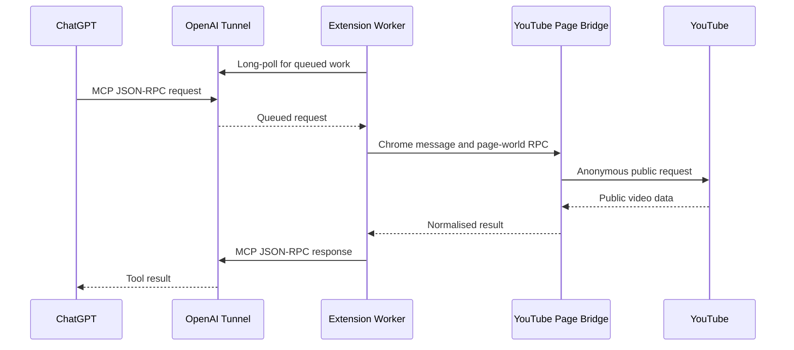

# Architecture

## Purpose and scope

ResearchTube is a Manifest V3 Chrome extension that implements a private MCP server for ChatGPT through an OpenAI Secure MCP Tunnel. It is designed for research on public YouTube content:

- video discovery;
- video metadata;
- the first public caption track as timestamped transcript text;
- public top-level comments and selected reply threads.

The extension is not a YouTube account client. It does not use YouTube cookies, does not perform account actions, and does not support private, member-only, age-restricted, or personalised content.

## System overview



The extension is the local tunnel client and the MCP server. The OpenAI tunnel provides the private, outbound-only transport; it does not expose a listener on the user's computer.

## Components

| Component | Source | Responsibility |
| --- | --- | --- |
| Manifest | `manifest.json` | Declares MV3 permissions, service worker, Options page, icons, and YouTube content scripts. |
| Service worker | `background.js` | Polls the tunnel, implements JSON-RPC/MCP, validates tool input, searches and reads metadata, manages YouTube tabs, and sends tool responses. |
| Isolated content script | `youtube-content.js` | Bridges extension messages to and from the YouTube MAIN world using origin-checked `window.postMessage`. |
| MAIN-world bridge | `youtube-page-bridge.src.js` → `youtube-page-bridge.js` | Runs in a `youtube.com` document and performs transcript, comment, and reply operations in the normal YouTube page origin. |
| Onboarding and settings | `onboarding.*`, `options.*`, `popup.*` | Provide local setup, status, and connection-test UI. The Tunnel ID and restricted OpenAI API key are stored in `chrome.storage.local`; the control-plane address is fixed in the service worker. |
| Bundled dependency | `youtubei.js` | Used only in the MAIN-world bridge for comments and reply continuations. |

## Request lifecycle

### Secure MCP Tunnel transport

`background.js` uses the OpenAI tunnel control plane:

1. Read the Tunnel ID and restricted API key from `chrome.storage.local`; the OpenAI control-plane address is a code constant (`https://api.openai.com`), not a user-configurable setting.
2. Long-poll `GET /v1/tunnels/{tunnel_id}/poll` with `limit=1` and a 15-second server timeout.
3. For each queued JSON-RPC command, call `handleMcpRequest`.
4. Post the MCP response to `POST /v1/tunnels/{tunnel_id}/response`.
5. Schedule exactly one successor poll shortly after the previous poll completes. Repeated wake-ups from Chrome, Settings, or the popup share that one scheduler and cannot multiply tunnel polls.

An alarm runs every 30 seconds as a recovery mechanism when Chrome has suspended the MV3 service worker. Polling is automatic and is not a user-facing setting.

The control-plane request carries the restricted OpenAI API key. It never enters a YouTube request or page-world message.

### Search pacing and YouTube verification

`youtube_search` is intentionally more conservative than the tunnel transport:

- Requests are placed in one local FIFO queue, with at least three seconds between search starts.
- Identical `(query, limit)` calls share a cached result or in-flight request for five minutes.
- A YouTube redirect to its verification flow, an HTTP 403, or an HTTP 429 starts a persisted backoff ladder of **2, 5, 10, 20, 40, then 60 seconds**. A successful search resets the ladder.
- During the backoff ResearchTube returns the MCP tool error `YOUTUBE_SEARCH_RATE_LIMITED` with the concrete retry delay. It does not add `google.com` permissions or attempt to bypass verification.

The toolbar icon mirrors the local state: `…` while a tool runs, `!` during a YouTube-search backoff, and `×` when the tunnel connection needs attention. The popup shows the remaining search delay.

### MCP protocol handling

The worker implements these MCP methods:

- `initialize` returns server information `researchtube` and the tools capability.
- `notifications/initialized` is acknowledged without a response payload.
- `tools/list` returns the five production tool definitions.
- `tools/call` validates arguments, executes the selected handler, and returns either a structured success result or a tool execution error.

Successful calls include both `content` (JSON text for compatibility) and `structuredContent` (machine-readable output). Expected execution failures return `isError: true`; malformed JSON-RPC requests use JSON-RPC errors. Normal successful outputs contain research data only: they never expose selected tab IDs, page-bridge transport, client profile, session mode, or other execution diagnostics.

Each tool definition has a title, an LLM-facing description, strict input and output JSON schemas (`additionalProperties: false`), and MCP annotations. Search and metadata are read-only. Transcript, comments, and replies are marked non-destructive but not strictly read-only because they may create an inactive local YouTube tab.

## Tool data paths

### Search: `youtube_search`

The worker performs an anonymous request to `/results?search_query=...`, extracts `ytInitialData`, and normalises `videoRenderer` entries. If the first page is not enough, it follows the search continuation through `youtubei/v1/search` using public client data extracted from the page.

Output is a compact result list with ID, title, channel, URL, duration and publication text, normalized numeric views plus YouTube's display text, and a snippet when available.

### Video metadata: `youtube_get_video`

The worker anonymously fetches `/watch?v={videoId}`, extracts `ytInitialPlayerResponse` and `ytInitialData`, and returns:

- title, description, channel, duration, category, tags, thumbnail, and caption-track metadata only (not caption text);
- normalized numeric views, likes, and comment count, each paired with the original YouTube display text;
- an absolute publication date when YouTube supplies one.

### Transcript: `youtube_get_transcript`

Transcript retrieval runs in the YouTube MAIN world to use a normal `youtube.com` request context while staying anonymous:

1. The worker reuses the first open `https://www.youtube.com/` tab. If none exists, it creates one with `active: false` and waits for it to load. If the selected tab disappears or its page bridge becomes unreachable while the operation is running, the worker creates one fresh inactive tab and retries the operation once.
2. The isolated content script sends a `transcript-player` RPC through `window.postMessage`.
3. The MAIN-world bridge anonymously fetches `/watch?v={videoId}` and extracts the current `INNERTUBE_API_KEY`.
4. It sends a minimal `ANDROID /youtubei/v1/player` request with client version `20.10.38`.
5. It selects exactly `captionTracks[0]`, the primary public track by this project's definition.
6. It fetches that track's `baseUrl` with `credentials: "omit"`.
7. It parses JSON3 or XML timedtext into ordered `{ start, duration, text }` segments.

The XML parser handles both common timestamp forms:

- `start` / `dur` in seconds;
- srv3 `t` / `d` in milliseconds.

The parser deliberately does not use `DOMParser`, avoiding YouTube Trusted Types restrictions in the page world.

### Comments: `youtube_get_comments`

Comments run in the MAIN world through the bundled browser build of `youtubei.js` with the `WEB` client. The bridge uses `getComments(videoId, TOP_COMMENTS | NEWEST_FIRST)` and follows continuation pages until it reaches the requested limit or YouTube has no more results.

Each thread is normalised to a stable, compact public representation: explicit YouTube rank, comment ID, author and channel ID, text, relative publication text, normalized likes and reply count paired with display text, and pinned/hearted/reply flags. YouTube does not reliably expose an absolute timestamp in every comment response, so `publishedAt` is explicitly `null` when unavailable rather than inferred from relative text.

### Replies: `youtube_get_comment_replies`

The tool first loads the comment area for the supplied video, finds the selected top-level `commentId`, obtains its thread, and follows reply continuations until the requested limit. It returns a compact parent summary, ranked replies, and `totalReplies` alongside `returned`, so a caller can distinguish the loaded sample from the whole discussion. It returns only that branch; it does not re-enumerate all top-level comments.

## Page-context bridge

The page-context transport exists because a request sent by the extension service worker has the extension's network context, while the MAIN-world bridge performs `fetch` from a `youtube.com` document.

The boundary is intentionally narrow:

1. `background.js` sends a typed Chrome message to the tab.
2. `youtube-content.js` validates `event.source === window` and `event.origin === location.origin`.
3. It forwards only the action and non-secret arguments through `window.postMessage`.
4. `youtube-page-bridge.js` executes an allowlisted action and posts a normalised result back.

No cookie values, request headers, or API key values are sent through this bridge.

For an already open tab whose content script belongs to an older extension build, the worker does not reload the user's tab. It creates a fresh inactive YouTube tab with the current bridge instead. A pre-existing tab that predates extension installation can receive one on-demand injection of the two local bridge files. If the selected tab is closed, its bridge becomes unreachable, or its MAIN-world RPC times out mid-call, the worker performs one bounded recovery attempt with a new inactive tab. It does not retry normal YouTube or parsing errors.

## Privacy and security model

### Credentials

All YouTube data requests explicitly use `credentials: "omit"`. The manifest does not request Chrome's `cookies` permission. The extension does not use SAPISID, YouTube account headers, or personal session data.

### Secrets

The Tunnel ID and restricted OpenAI API key are stored in `chrome.storage.local`. They are not embedded in source code, committed to the repository, sent to YouTube, or exposed to the page-world bridge.

Use a dedicated key with only `Tunnels: Read + Use`. Creating or changing a tunnel should be done with a separate, more privileged Platform session or key.

### Permissions

| Permission | Why it is needed |
| --- | --- |
| `storage` | Store connection settings and last connection status. |
| `alarms` | Recover tunnel polling after service-worker suspension. |
| `tabs` | Locate or create an inactive YouTube tab. |
| `scripting` | Inject local bridge scripts into a pre-existing YouTube tab when necessary. |
| `https://api.openai.com/*` | Tunnel control-plane polling and responses. |
| `https://www.youtube.com/*` | Public YouTube pages and MAIN-world bridge injection. |

## Build and verification

```bash
npm install
npm run build
npm run check
```

`npm run build` bundles `background.js` to `dist/background.js` and bundles the browser-compatible `youtubei.js` dependency plus `youtube-page-bridge.src.js` into `youtube-page-bridge.js`. The extension never loads a remote script at runtime.

`npm run check` rebuilds and performs JavaScript syntax checks for the source and generated bundles. Functional verification still requires a loaded Chrome extension, an active tunnel, and publicly accessible YouTube videos.

## Repository layout

```text
.
├── background.js                 # MV3 worker and MCP server
├── youtube-content.js            # isolated-world bridge
├── youtube-page-bridge.src.js    # MAIN-world source and YouTube transport
├── youtube-page-bridge.js        # generated MAIN-world bundle
├── options.html / options.js     # local configuration UI
├── manifest.json                 # Chrome extension manifest
├── icons/                        # Chrome extension icon sizes
├── docs/ARCHITECTURE.md          # this document
└── docs/images/                  # redacted README screenshots
```

## Limits and maintenance

- YouTube's internal response formats and access controls can change without notice.
- Some public videos have no captions, no comments, or restricted data.
- The project intentionally returns only the primary caption track; language selection is outside the current contract.
- The extension depends on `youtubei.js` for comments and replies. Update it carefully and verify continuations against live public videos.
- This is a private developer-mode integration. Secure MCP Tunnel does not make this extension a publicly distributed OpenAI plugin.

## Extension points

When adding a tool:

1. Add one narrowly scoped handler in `background.js`.
2. Add a precise tool definition with strict schemas, truthful annotations, and a description that tells the model what it does and does not return.
3. Reuse the page bridge only when YouTube page context is required.
4. Return normalised public data, never raw cookies or full unbounded YouTube responses.
5. Add validation in the MCP contract test and test the flow in a real Chrome profile.
