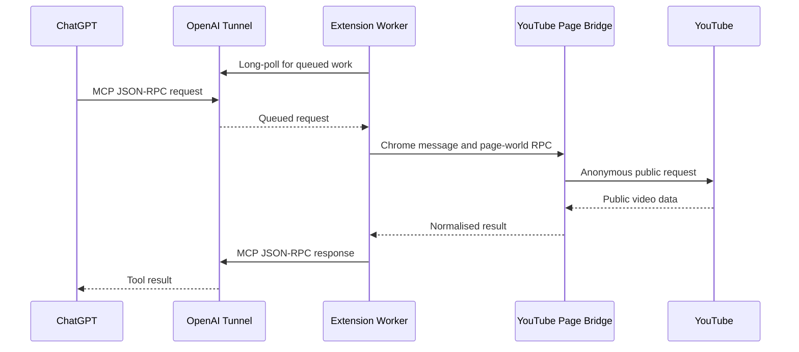

# Architecture


## Instructions for AI coding tools

This document is the authoritative architecture contract for ResearchTube. An LLM or other coding agent must read the whole document before changing the project or generating a ResearchTube extension.

When implementing a request:

1. First classify the change as one of four kinds: existing Chrome/MCP functionality, YouTube page-context functionality, built-in Local Agent functionality, or a third-party external extension.
2. Change only the layer that owns that responsibility. Do not move working YouTube page-context code into the Agent merely because an Agent exists.
3. Preserve the invariant that the Chrome Extension is the MCP-facing component and the Local Agent uses a private ResearchTube protocol.
4. Preserve public-data and credential boundaries. Never pass OpenAI secrets into YouTube code or page-world messages.
5. Preserve the built-in workspace sandbox for Agent file tools.
6. Treat external extensions as trusted arbitrary executable code, not as sandboxed built-ins.
7. Do not introduce schedulers, global concurrency limits, push-event systems, background infrastructure, or new runtimes unless a concrete requirement in this document needs them.
8. Prefer the smallest implementation that preserves the contracts below.

If a requested implementation conflicts with this document, the coding agent should surface the conflict rather than silently inventing a new architecture.

## Purpose and scope

ResearchTube is a Manifest V3 Chrome extension that implements a private MCP server for ChatGPT through an OpenAI Secure MCP Tunnel. It is designed for research on public YouTube content:

- video discovery;
- video metadata;
- public caption tracks and timestamped transcript text from a selected track;
- public top-level comments and selected reply threads.

The extension is not a YouTube account client. It does not use YouTube cookies, does not perform account actions, and does not support private, member-only, age-restricted, or personalised content.

## System overview



The extension is the local tunnel client and the MCP server. The OpenAI tunnel provides the private, outbound-only transport; it does not expose a listener on the user's computer.

## Components

| Component | Source | Responsibility |
| --- | --- | --- |
| Manifest | `manifest.json` | Declares MV3 permissions, service worker, Options page, icons, and YouTube content scripts. |
| Service worker | `background.js` | Polls the tunnel, implements JSON-RPC/MCP, validates tool input, searches and reads metadata, manages YouTube tabs, and sends tool responses. |
| Isolated content script | `youtube-content.js` | Bridges extension messages to and from the YouTube MAIN world using origin-checked `window.postMessage`. |
| MAIN-world bridge | `youtube-page-bridge.src.js` → `youtube-page-bridge.js` | Runs in a `youtube.com` document and performs search, transcript, comment, and reply operations in the normal YouTube page origin without navigating the user's tab. |
| Settings and popup | `onboarding.*`, `popup.*` | Provide the single local Settings page, status, connection-test UI, and toolbar status. The Tunnel ID and restricted OpenAI API key are stored in `chrome.storage.local`; the control-plane address is fixed in the service worker. |
| Bundled dependency | `youtubei.js` | Used only in the MAIN-world bridge for comments and reply continuations. |

## Request lifecycle

### Secure MCP Tunnel transport

`background.js` uses the OpenAI tunnel control plane:

1. Read the Tunnel ID and restricted API key from `chrome.storage.local`; the OpenAI control-plane address is a code constant (`https://api.openai.com`), not a user-configurable setting.
2. Long-poll `GET /v1/tunnels/{tunnel_id}/poll` with `limit=1` and a 15-second server timeout.
3. For each queued JSON-RPC command, call `handleMcpRequest`.
4. Post the MCP response to `POST /v1/tunnels/{tunnel_id}/response`.
5. Schedule exactly one successor poll shortly after the previous poll completes. Repeated wake-ups from Chrome, Settings, or the popup share that one scheduler and cannot multiply tunnel polls.

An alarm runs every 30 seconds as a recovery mechanism when Chrome has suspended the MV3 service worker. Polling is automatic and is not a user-facing setting.

The control-plane request carries the restricted OpenAI API key. It never enters a YouTube request or page-world message.

### Search pacing and YouTube verification

`youtube_search` is intentionally more conservative than the tunnel transport:

- Requests are placed in one local FIFO queue, with at least 500 ms between search starts.
- Identical `(query, limit)` calls share a cached result or in-flight request for five minutes.
- A YouTube redirect to its verification flow, an HTTP 403, or an HTTP 429 starts a persisted backoff ladder of **2, 5, 10, 20, 40, then 60 seconds**. A successful search or an expired delay resets the ladder, so a new incident always starts at two seconds.
- During the backoff ResearchTube returns the MCP tool error `YOUTUBE_SEARCH_RATE_LIMITED` with the concrete retry delay. It does not add `google.com` permissions or attempt to bypass verification.

The toolbar icon mirrors the local state: `…` while a tool runs, `!` during a YouTube-search backoff, and `×` when the tunnel connection needs attention. The popup shows the remaining search delay.

### MCP protocol handling

The worker implements these MCP methods:

- `initialize` returns server information `researchtube` and the tools capability.
- `notifications/initialized` is acknowledged without a response payload.
- `tools/list` returns the eight production tool definitions.
- `tools/call` validates arguments, executes the selected handler, and returns either a structured success result or a tool execution error.

Successful calls include both `content` (JSON text for compatibility) and `structuredContent` (machine-readable output). Expected execution failures return `isError: true`; malformed JSON-RPC requests use JSON-RPC errors. Normal successful outputs contain research data only: they never expose selected tab IDs, page-bridge transport, client profile, session mode, or other execution diagnostics.

Each tool definition has a title, an LLM-facing description, strict input and output JSON schemas (`additionalProperties: false`), and MCP annotations. Video metadata is read-only. Search, channel catalogues, playlists, transcript, comments, and replies are non-destructive but not strictly read-only because they may create an inactive local YouTube tab.

## Tool data paths

### Search: `youtube_search`

The worker routes search through the MAIN-world bridge in an already open YouTube document. The bridge anonymously fetches `/results?search_query=...`, extracts `ytInitialData`, and normalises `videoRenderer` entries. If the first page is not enough, it follows the search continuation through `youtubei/v1/search` using public client data extracted from the response. The bridge never changes the selected tab's URL, playback, or DOM.

Output is a compact result list with ID, title, channel, URL, duration and publication text, normalized integer views plus YouTube's display text, and a snippet when available.

### Channel catalogue: `youtube_get_channel_videos`

The bridge anonymously fetches the selected channel's `/videos` page. It accepts an `@handle`, complete YouTube channel URL, or `UC...` channel ID, extracts the channel identity and compact video cards from `ytInitialData`, and follows an explicitly supplied opaque continuation through `/youtubei/v1/browse` when needed. Both legacy `gridVideoRenderer` / `videoRenderer` cards and current `lockupViewModel` cards are normalized to the same stable output.

Each item contains the video ID, title, watch URL, duration and duration in seconds, publication display text, normalized integer views plus display text, and Shorts/live flags. Catalogue pages do not reliably include like or comment counts, so callers use `youtube_get_video` only for selected videos that need those details. The optional `includeShorts` and `includeStreams` filters are applied to YouTube's own renderer labels.

### Channel playlists: `youtube_get_channel_playlists`

The bridge fetches the channel's `/playlists` page using the same public page context and normalizes its playlist cards. It supports legacy playlist renderers and the current `lockupViewModel` representation. It returns playlist ID, title, displayed and normalized video count, thumbnail, and an opaque continuation. No videos are fetched by this tool; use a returned ID with `youtube_get_playlist_videos`.

### Playlist catalogue: `youtube_get_playlist_videos`

The bridge fetches `/playlist?list={playlistId}` for a public playlist ID or URL and normalizes legacy playlist renderers, playlist panel cards, and current lockup cards. It preserves the displayed playlist position when YouTube provides it, along with the same compact video fields used for channel catalogues. Continuations use anonymous `/youtubei/v1/browse` requests in the page world. This is a catalogue operation only: transcript and comments remain separate, targeted MCP calls.

### Video metadata: `youtube_get_video`

The worker anonymously fetches `/watch?v={videoId}`, extracts `ytInitialPlayerResponse` and `ytInitialData`, and returns:

- title, description, channel, duration, category, tags, thumbnail, and caption-track metadata only (not caption text). Every track includes a zero-based `trackIndex`, language code, display name, and auto-generated flag;
- normalized integer views, likes, and comment count, each paired with the original YouTube display text;
- an absolute publication date when YouTube supplies one.

### Transcript: `youtube_get_transcript`

Transcript retrieval runs in the YouTube MAIN world to use a normal `youtube.com` request context while staying anonymous:

1. The worker reuses the first open `https://www.youtube.com/` tab. If none exists, it creates one with `active: false` and waits for it to load. If the selected tab disappears or its page bridge becomes unreachable while the operation is running, the worker creates one fresh inactive tab and retries the operation once.
2. The isolated content script sends a `transcript-player` RPC through `window.postMessage`.
3. The MAIN-world bridge anonymously fetches `/watch?v={videoId}` and extracts the current `INNERTUBE_API_KEY`.
4. It sends a minimal `ANDROID /youtubei/v1/player` request with client version `20.10.38`.
5. It selects `captionTracks[trackIndex]`. `trackIndex` defaults to `0`, the primary public track; callers can obtain the available choices from `youtube_get_video` and request another track explicitly.
6. It fetches the selected track's `baseUrl` with `credentials: "omit"`.
7. It parses JSON3 or XML timedtext into ordered `{ start, duration, text }` segments.

The XML parser handles both common timestamp forms:

- `start` / `dur` in seconds;
- srv3 `t` / `d` in milliseconds.

The parser deliberately does not use `DOMParser`, avoiding YouTube Trusted Types restrictions in the page world.

### Comments: `youtube_get_comments`

Comments run in the MAIN world through the bundled browser build of `youtubei.js` with the `WEB` client. The bridge uses `getComments(videoId, TOP_COMMENTS | NEWEST_FIRST)` and follows continuation pages until it reaches the requested limit or YouTube has no more results.

Each thread is normalised to a stable, compact public representation: explicit YouTube rank, comment ID, author and channel ID, text, relative publication text, normalized likes and reply count paired with display text, and pinned/hearted/reply flags. YouTube does not reliably expose an absolute timestamp in every comment response, so `publishedAt` is explicitly `null` when unavailable rather than inferred from relative text.

### Replies: `youtube_get_comment_replies`

The tool first loads the comment area for the supplied video, finds the selected top-level `commentId`, obtains its thread, and follows reply continuations until the requested limit. It returns a compact parent summary, ranked replies, and `totalReplies` alongside `returned`, so a caller can distinguish the loaded sample from the whole discussion. It returns only that branch; it does not re-enumerate all top-level comments.

## Page-context bridge

The page-context transport exists because a request sent by the extension service worker has the extension's network context, while the MAIN-world bridge performs `fetch` from a `youtube.com` document.

The boundary is intentionally narrow:

1. `background.js` sends a typed Chrome message to the tab.
2. `youtube-content.js` validates `event.source === window` and `event.origin === location.origin`.
3. It forwards only the action and non-secret arguments through `window.postMessage`.
4. `youtube-page-bridge.js` executes an allowlisted action and posts a normalised result back.

No cookie values, request headers, API key values, response bodies, transcript text, or comment text are sent through this bridge for diagnostics. The Settings diagnostic export contains only concise tool timing, safe argument summaries, errors, queue events, and YouTube HTTP metadata.

For an already open tab whose content script belongs to an older extension build, the worker does not reload the user's tab. It creates a fresh inactive YouTube tab with the current bridge instead. A pre-existing tab that predates extension installation can receive one on-demand injection of the two local bridge files. If the selected tab is closed, its bridge becomes unreachable, or its MAIN-world RPC times out mid-call, the worker performs one bounded recovery attempt with a new inactive tab. It does not retry normal YouTube or parsing errors.

## Privacy and security model

### Credentials

All YouTube data requests explicitly use `credentials: "omit"`. The manifest does not request Chrome's `cookies` permission. The extension does not use SAPISID, YouTube account headers, or personal session data.

### Secrets

The Tunnel ID and restricted OpenAI API key are stored in `chrome.storage.local`. They are not embedded in source code, committed to the repository, sent to YouTube, or exposed to the page-world bridge.

`youtubei.js` normally bundles static public YouTube client-key literals. The build step replaces those literals with a getter for the live `INNERTUBE_API_KEY` on the YouTube document. The release bundle therefore does not contain a Google-style API-key literal.

Use a dedicated key with only `Tunnels: Read + Use`. Creating or changing a tunnel should be done with a separate, more privileged Platform session or key.

### Permissions

| Permission | Why it is needed |
| --- | --- |
| `storage` | Store connection settings and last connection status. |
| `alarms` | Recover tunnel polling after service-worker suspension. |
| `tabs` | Locate or create an inactive YouTube tab. |
| `scripting` | Inject local bridge scripts into a pre-existing YouTube tab when necessary. |
| `https://api.openai.com/*` | Tunnel control-plane polling and responses. |
| `https://www.youtube.com/*` | Public YouTube pages and MAIN-world bridge injection. |


## Product architecture with the Local Agent

ResearchTube v1 is one product with two cooperating runtime parts:

    ChatGPT / LLM
          |
          | MCP over OpenAI Secure MCP Tunnel
          v
    +----------------------------------+
    | ResearchTube Chrome Extension    |
    |                                  |
    | - MCP server / adapter           |
    | - existing YouTube research      |
    | - Settings and tunnel transport  |
    +----------------+-----------------+
                     |
                     | private ResearchTube HTTP/JSON
                     | 127.0.0.1:<configured port>
                     v
    +----------------------------------+
    | ResearchTube Local Agent         |
    | Python / asyncio                 |
    |                                  |
    | - local files                    |
    | - workspace sandbox              |
    | - yt-dlp                         |
    | - ffmpeg / ffprobe               |
    | - long-running tasks             |
    | - external extension launcher    |
    +----------------------------------+

The Local Agent is optional. The existing public YouTube research tools must continue to work when the Agent is absent. Agent-backed tools may report that the Agent is required, but Agent absence must not break unrelated YouTube search, transcript, comments, channel, or playlist functionality.

The Agent is not a general-purpose public MCP server. The Chrome Extension remains the MCP-facing component. The Extension may translate MCP calls into a private local request format and translate Agent responses back into MCP results. Because both sides belong to ResearchTube, that private protocol may evolve with the product without supporting arbitrary third-party MCP clients.

### Local transport

The Agent binds only to loopback:

    127.0.0.1:<port>

It must not bind to 0.0.0.0 by default.

The default v1 port is:

    17843

The port is configurable in both the Agent configuration and Chrome Extension Settings. No automatic port discovery is required for v1. The Settings page contains a Local Agent section with the configured port and a Test connection button.

The first permanent Agent-backed MCP tool is:

    researchtube_agent_status

It is not a temporary ping. It reports the state of the optional Local Agent by calling the same Agent health endpoint used by the Settings Test connection button:

    GET /health

The MCP tool remains valid when the Agent is unavailable; it should return a normal structured result indicating AGENT_UNAVAILABLE rather than turning the absence of an optional local component into a malformed MCP request.

Do not duplicate MCP tool discovery inside Agent health. MCP tools/list remains the source of truth for LLM-visible tools.

## Local installation and workspace

For v1, keep the local installation visible and simple. The intended installed layout is flat for executable components:

    ResearchTube/
    ├── ResearchTubeAgent.exe      Windows example
    ├── yt-dlp.exe
    ├── ffmpeg.exe
    ├── ffprobe.exe
    ├── workspace/
    └── extensions/

Linux and macOS use platform-appropriate executable names.

Do not create a runtime directory merely to hide the native executables. The ResearchTube root is the directory containing the Agent executable or development entry script, not the process current working directory. This matters when the Agent is launched from another directory.

The normal ResearchTube installation should not require a system Python merely to run ResearchTube. The project may package its own Python Agent for each platform. A third-party extension that chooses Python may require its own system/runtime dependency; that is the extension author's responsibility.

### Workspace sandbox

The workspace directory is the root for built-in ResearchTube file operations:

    ResearchTube/workspace/

Built-in Agent tools must accept workspace-relative paths and resolve them canonically before access. A path that resolves outside the workspace must be rejected. This includes parent traversal and equivalent path tricks.

The sandbox protects built-in ResearchTube tools only. It does not contain the Agent executable, yt-dlp, ffmpeg, ffprobe, or the extensions directory.

If workspace is missing, the Agent should attempt to create it. If creation or access fails, health must expose that condition.

Do not build a transactional filesystem or complex lock manager in v1. Concurrent conflicting operations may fail naturally and return structured errors.

## Native executable discovery

For yt-dlp, ffmpeg, and ffprobe use this lookup order:

    1. executable next to the ResearchTube Agent
    2. executable resolved through the operating-system PATH
    3. missing

A local bundled executable always wins over PATH. This allows normal users to use tested bundled versions while developers can omit them and reuse tools already installed on the machine.

For every resolved component, keep enough information for diagnostics:

    status   = available | missing | error
    version  = detected version or null
    source   = local | path | null
    path     = actual resolved executable path or null

An example health payload is:

    {
      "status": "ok",
      "agentVersion": "0.1.0",
      "workspace": {
        "status": "available"
      },
      "components": {
        "ytDlp": {
          "status": "available",
          "version": "2026.xx.xx",
          "source": "local",
          "path": "D:\\ResearchTube\\yt-dlp.exe"
        },
        "ffmpeg": {
          "status": "available",
          "version": "...",
          "source": "path",
          "path": "C:\\Tools\\ffmpeg.exe"
        },
        "ffprobe": {
          "status": "missing",
          "version": null,
          "source": null,
          "path": null
        }
      }
    }

Agent health describes local installation state; it is not another tool-capability registry.

## Agent console logging

The v1 Agent uses compact human-readable console logging so a user can see that it is alive and receiving work.

Use a simple timestamp prefix:

    [HH:MM:SS] message

At startup, log at least:

- Agent version;
- listening host and port;
- workspace path/status;
- yt-dlp version/source/path or missing/error;
- ffmpeg version/source/path or missing/error;
- ffprobe version/source/path or missing/error.

Example:

    [21:59:03] ResearchTube Agent 0.1.0 started
    [21:59:03] Listening on 127.0.0.1:17843
    [21:59:03] Workspace: D:\ResearchTube\workspace
    [21:59:03] yt-dlp: 2026.09.18 (local: D:\ResearchTube\yt-dlp.exe)
    [21:59:03] ffmpeg: 8.0 (PATH: C:\Tools\ffmpeg.exe)
    [21:59:03] ffprobe: missing
    [21:59:08] GET /health -> 200

Log top-level requests and important task lifecycle events. Do not dump complete protocol JSON or every internal call by default. INFO and ERROR are sufficient concepts for v1; rotating file logs and a large logging subsystem are not required.

## Asynchronous execution and MCP Tasks

The Agent is an asynchronous coordinator built around Python asyncio. Long-running native operations must use asynchronous subprocess APIs so the Agent stays responsive while operating-system processes perform the work.

Conceptually:

    ResearchTube Agent
          |
          +-- Task A -> yt-dlp subprocess
          +-- Task B -> yt-dlp subprocess
          +-- Task C -> ffmpeg subprocess
          +-- short health/file requests continue concurrently

Do not add an internal jobId. Use the MCP taskId concept end-to-end, including as the key in the Agent TaskManager.

The v1 task model is polling-based. Push events are deliberately out of scope. The Extension maps between MCP Tasks and the Agent's private task operations. The useful lifecycle is:

    tools/call
        -> create taskId
        -> Agent starts async work
        -> MCP receives task handle

    tasks/get(taskId)
        -> Extension queries Agent
        -> working / completed / failed / cancelled

    tasks/cancel(taskId)
        -> Extension asks Agent to terminate/cancel work

The Agent should keep only the state needed to answer polling and cancellation requests, for example:

    taskId
    status
    progress
    message
    result
    error
    process
    createdAt
    updatedAt

Task persistence across Agent restarts is not required for the first implementation.

### Task ID format

ResearchTube task IDs use 96 bits of cryptographically strong randomness encoded as URL-safe Base64 without padding. In Python the intended generation is equivalent to:

    secrets.token_urlsafe(12)

This yields a compact 16-character URL-safe identifier. Do not replace it with a sequential counter and do not introduce a second identifier for the same task.

### Concurrency policy

Independent tasks are independent. Do not impose arbitrary global semaphores or concurrency limits on yt-dlp, ffmpeg, file operations, or external modules merely to protect the user from high CPU/network/disk usage. If a user starts many operations, the operating system and native programs may naturally become slower.

Serialization is allowed only where a concrete backend requires it. The existing YouTube page-context search queue is an example: it exists because parallel page-context traffic may trigger YouTube verification/rate limiting, not because ResearchTube has a general one-request-at-a-time policy.

Short requests, task polling, and unrelated operations must remain responsive while long tasks execute.

## Agent-backed built-in tools

The planned first built-in local tools are intentionally narrow:

    researchtube_agent_status
    youtube_download
    media_probe
    media_capture_frame
    media_extract_audio_clip
    workspace_list
    workspace_stat
    workspace_mkdir
    workspace_move
    workspace_delete

These are ResearchTube built-ins, not external extensions. Implement them directly in the Agent and expose them through the Chrome MCP adapter.

The existing YouTube browsing/research tools remain in their current Chrome/page-context implementation unless there is a demonstrated reason to move one later.

### youtube_download

youtube_download is the first intended long-running Agent-backed tool. It launches yt-dlp asynchronously and returns an MCP Task.

Multiple calls for the same video are still separate tasks. Do not deduplicate them in v1.

Every downloaded file must include both the YouTube video ID and the complete ResearchTube taskId in its filename so independent simultaneous downloads cannot collide merely because they refer to the same video.

The intended naming form is:

    <sanitized title> [yt_<youtubeId>] [<taskId>].<ext>

The YouTube prefix is exactly lowercase:

    yt_

Example:

    Why Gravity Is Not a Force [yt_XRr1kaXKBsU] [5Jr8pL2xQmN4_vZa].mp4

The title must be sanitized for portable filesystem use. Prefer yt-dlp's filename handling rather than maintaining a second elaborate sanitizer. Use Windows-compatible filename rules as the cross-platform baseline and trim overly long titles conservatively. Preserve Unicode where possible; do not use an aggressively ASCII-only naming policy by default.

Large downloaded video data is never returned inline through MCP. Return workspace-relative file metadata.

### media_probe

media_probe returns metadata for an existing workspace media file using ffprobe: duration, container, streams, codecs, dimensions, frame rate, and other bounded metadata useful to later tools.

### media_capture_frame

media_capture_frame extracts an image at a requested timestamp. The Extension should expose the returned image to MCP as an image content block when inline return is requested; do not present raw base64 text to the LLM as if it were the user-facing result.

### media_extract_audio_clip

media_extract_audio_clip extracts a short audio interval. The v1 design uses a hard maximum duration of approximately 30 seconds so an LLM call cannot accidentally request an unbounded inline audio payload. The Extension should translate inline audio to the corresponding MCP audio content representation.

### Workspace operations

workspace_move also covers rename. workspace_delete and all other built-in file operations remain restricted to workspace. Do not add arbitrary shell execution as a built-in file tool.

## External ResearchTube extensions

External extensions are deliberately different from built-in Agent tools.

An external extension is an arbitrary executable program launched by the Agent. It may be written in Python, Node.js, C++, Rust, Go, Java, shell, or any other environment the user's machine can execute.

ResearchTube does not install language runtimes solely to support arbitrary third-party modules. If an extension requires Python, Node.js, Java, or another runtime, its author/user is responsible for that prerequisite.

External extensions are trusted executable code and run with the permissions of the current operating-system user. They are not constrained by the built-in workspace sandbox. Documentation and UI must not imply that third-party extensions are sandboxed.

### Extension directory

Each extension lives under:

    ResearchTube/extensions/<extension-id>/

Example:

    ResearchTube/
    └── extensions/
        └── example-hello/
            ├── module.json
            ├── hello.cmd
            └── hello.sh

The Agent, not the Chrome Extension, reads the local extension files.

### Manifest contract

module.json is the declarative contract that lets the Agent discover an extension and lets the Chrome Extension publish its tools through MCP.

A minimal cross-platform example is:

    {
      "id": "example-hello",
      "version": "1.0.0",
      "commands": {
        "windows": ["cmd.exe", "/d", "/s", "/c", "hello.cmd"],
        "linux": ["/bin/sh", "hello.sh"],
        "macos": ["/bin/sh", "hello.sh"]
      },
      "tools": [
        {
          "name": "example_hello",
          "description": "Minimal example ResearchTube extension",
          "inputSchema": {
            "type": "object",
            "properties": {},
            "additionalProperties": false
          }
        }
      ]
    }

Rules:

- id identifies the extension directory/package.
- version is the extension's own version.
- commands selects the process command for the current platform.
- relative script/executable paths are resolved relative to that extension directory.
- tools contains one or more LLM-visible tool definitions.
- each tool needs a stable name, a precise LLM-facing description, and a JSON input schema.
- an outputSchema may be supplied when the extension has a stable structured output and is strongly recommended for nontrivial tools.
- tool descriptions must explain important limits and side effects; do not hide destructive behavior from the model.

The exact manifest may gain optional fields later, but existing v1 fields should retain their meaning.

### External process protocol v1

The external module protocol is private ResearchTube JSON, not MCP. One module invocation corresponds to one process invocation, so no second correlation ID is required in the minimal protocol.

The Agent writes exactly one JSON request to the process stdin:

    {
      "tool": "example_hello",
      "arguments": {}
    }

The module writes exactly one JSON response object to stdout.

Success:

    {
      "result": {
        "message": "Hello from a ResearchTube extension"
      }
    }

Controlled error:

    {
      "error": {
        "code": "INPUT_INVALID",
        "message": "The supplied input is not valid",
        "data": {}
      }
    }

Protocol rules:

1. stdout is protocol-only. It must contain one valid JSON response object and no banners, progress text, or debugging chatter.
2. Logs and diagnostics go to stderr.
3. A normal controlled failure should return a structured error response.
4. Empty stdout, invalid JSON, process-launch failure, timeout, or an uncontrolled crash becomes a structured Agent module-execution/protocol error.
5. v1 does not require a streaming external-module protocol. If progress streaming is later needed, extend the protocol deliberately rather than accepting arbitrary mixed stdout text.

A minimal shell example is allowed to ignore stdin and simply emit a constant valid result. This is useful as the repository's zero-dependency reference extension and proves that the extension API is language-independent.

### Extension discovery and Refresh

The Settings page will contain an Extensions section with a Refresh action.

Refresh means:

    Chrome Extension
        -> ask Agent to rescan extensions/
        -> Agent reads and validates module.json files
        -> Agent returns the discovered tool catalogue
        -> Chrome Extension updates the MCP tool catalogue

The Chrome Extension must not browse the local filesystem itself.

An invalid extension must not break the Agent or hide otherwise valid extensions. Report validation failures diagnostically and continue scanning.

### External-extension execution model

The Agent launches the command declared by the module and connects stdin/stdout/stderr as pipes.

For short tools, the Agent can wait asynchronously for the process result without blocking unrelated requests.

For a future long-running external tool, the Agent may wrap the process in the same ResearchTube taskId/TaskManager mechanism used by built-in long operations. Do not require the external program itself to implement MCP.

## Where new functionality belongs

Use this decision table before coding:

| New functionality | Correct owner |
| --- | --- |
| MCP tunnel, tools/list, MCP schemas, mapping Agent results to MCP content | Chrome Extension / service worker |
| Anonymous YouTube requests requiring youtube.com page context | YouTube MAIN-world bridge plus existing Chrome bridge |
| Local filesystem, downloads, ffmpeg, ffprobe, native processes | Local Agent |
| Core ResearchTube local functionality shipped with the product | Built-in Agent module/handler |
| User-supplied arbitrary functionality | External extension under extensions/ |
| External extension discovery/launch | Local Agent |
| Display/configuration of Agent port and extension Refresh | Chrome Settings UI |

Do not create an external process merely to implement a trusted built-in ResearchTube feature. Conversely, do not import arbitrary third-party extension code directly into the Agent process when the executable-process contract is sufficient.


## Build and verification

```bash
npm install
npm run build
npm run check
```

`npm run build` bundles `background.js` to `dist/background.js` and bundles the browser-compatible `youtubei.js` dependency plus `youtube-page-bridge.src.js` into `youtube-page-bridge.js`. The extension never loads a remote script at runtime.

`npm run check` rebuilds and performs JavaScript syntax checks for the source and generated bundles. Functional verification still requires a loaded Chrome extension, an active tunnel, and publicly accessible YouTube videos.

## Repository layout

```text
.
├── background.js                 # MV3 worker and MCP server
├── youtube-content.js            # isolated-world bridge
├── youtube-page-bridge.src.js    # MAIN-world source and YouTube transport
├── youtube-page-bridge.js        # generated MAIN-world bundle
├── onboarding.html / onboarding.js # single local Settings UI
├── manifest.json                 # Chrome extension manifest
├── icons/                        # Chrome extension icon sizes
├── docs/ARCHITECTURE.md          # this document
└── docs/images/                  # redacted README screenshots
```

## Limits and maintenance

- YouTube's internal response formats and access controls can change without notice.
- Some public videos have no captions, no comments, or restricted data.
- Track `0` remains the default transcript, but callers can choose another public caption track by its `trackIndex` from `youtube_get_video`.
- The extension depends on `youtubei.js` for comments and replies. Update it carefully and verify continuations against live public videos.
- This is a private developer-mode integration. Secure MCP Tunnel does not make this extension a publicly distributed OpenAI plugin.

## Adding or changing tools

Before adding a tool, classify it using the ownership table above.

For an existing Chrome/page-context YouTube tool:

1. Add or update the narrowly scoped handler in the current Chrome/page-bridge path.
2. Keep the MCP definition precise, with strict schemas and truthful descriptions.
3. Reuse the page bridge only when YouTube page context is actually required.
4. Return normalized bounded data rather than raw unbounded YouTube responses.
5. Update contract validation and test in a real Chrome profile.

For a built-in Agent-backed tool:

1. Implement the local operation in the Agent.
2. Keep all built-in file paths workspace-relative and sandbox-checked.
3. Use async subprocesses for long native operations.
4. Use one taskId for the whole long-running lifecycle; do not invent jobId.
5. Add the MCP tool definition/adapter in the Chrome Extension.
6. Test Agent absent, Agent available, success, structured failure, and concurrent unrelated requests.

For a third-party external extension:

1. Create an extension directory under extensions/.
2. Add module.json with platform command(s) and precise tool schema(s).
3. Implement the stdin/stdout JSON contract exactly.
4. Write diagnostics to stderr, never mixed into protocol stdout.
5. Declare/document any external runtime prerequisite.
6. Use Settings Refresh to make the Agent rescan extensions and republish the tool catalogue.
7. Assume the module is trusted arbitrary code with normal user permissions; do not claim ResearchTube sandboxing for it.

The architecture should evolve only when a real implementation need appears. Prefer extending these contracts compatibly rather than adding parallel mechanisms for the same responsibility.
