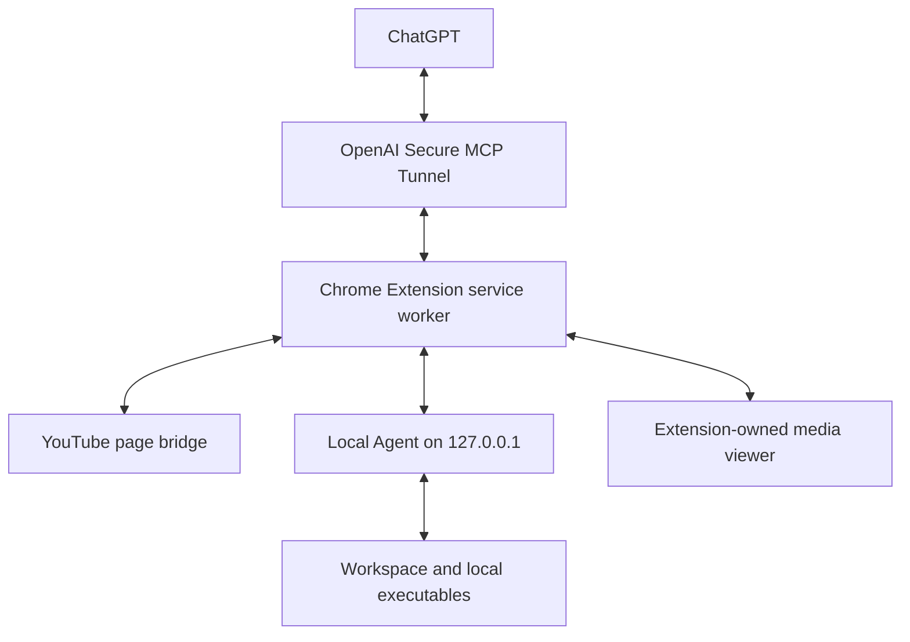
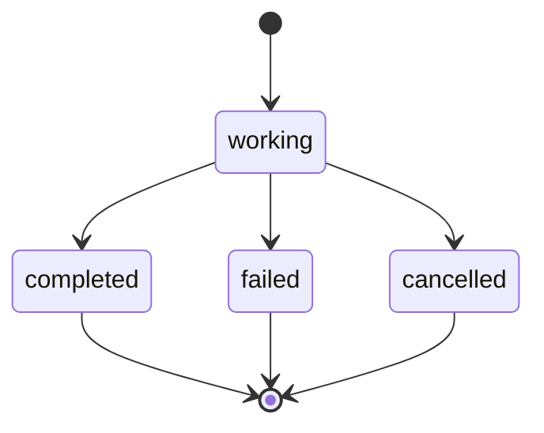

# ResearchTube architecture

## Purpose

ResearchTube connects ChatGPT to public YouTube research and local media operations without exposing a listener to the internet or sending large local media through MCP. The Chrome Extension is the MCP server and browser automation layer. The optional Python Local Agent owns local executables, the Workspace and media processing.

## System topology

```mermaid
flowchart TD
    C[ChatGPT] <--> T[OpenAI Secure MCP Tunnel]
    T <--> E[Chrome Extension service worker]
    E <--> Y[YouTube page bridge]
    E <--> A[Local Agent on 127.0.0.1]
    E <--> V[Extension-owned media viewer]
    A <--> W[Workspace and local executables]
```

The tunnel is outbound-only from the Extension. The Agent binds only to loopback. Browser page bridges are used only when a normal page origin or browser interaction is required.

## Components

| Component | Main sources | Responsibility |
| --- | --- | --- |
| MCP service worker | `extension/background.js` | Tunnel polling, MCP schemas, validation, task orchestration, Settings state and browser automation |
| YouTube isolated bridge | `extension/youtube-content.js` | Typed boundary between Extension messages and the YouTube page world |
| YouTube MAIN bridge | `extension/youtube-page-bridge.src.js` | Anonymous requests in a normal `youtube.com` origin for public research data |
| Storyboard Extension module | `extension/storyboards.js` | Storyboard schemas, validation and public result projection |
| ChatGPT media bridge | `extension/chatgpt-capture-frame-bridge.js` | Finds the exact MCP widget iframe and installs the local viewer overlay |
| Current-chat binding | `extension/chatgpt-chat-target-bridge.js`, `extension/ui/chat-target-v1.html` | Compact task handshake using Chrome sender identity, independent of ChatGPT layout |
| Local media viewer | `extension/media-viewer.html` | Loads image, video or audio bytes from loopback with Extension permissions; packaged script in `media-viewer.js` |
| Settings and popup | `extension/settings.*`, `extension/popup.*` | Connection, Agent status, tool availability and bounded diagnostics |
| Local Agent | `agent/researchtube_agent.py`, `agent/custom_tools.py` | Workspace, executable discovery, downloads, FFmpeg operations, speech callbacks, Custom Tools and loopback media serving |
| Timer Agent module | `agent/timers.py`, `agent/task_history.py` | Real durations/deadlines, clock diagnostics and bounded terminal-task history |
| Storyboard Agent module | `agent/storyboards.py` | Storyboard discovery, selection, downloads, timestamps and task lifecycle |

Generated files are `extension/dist/background.js` and `extension/youtube-page-bridge.js`. Their source files must be changed first.

## MCP request lifecycle

1. The Extension reads the Tunnel ID and restricted API key from `chrome.storage.local`.
2. It long-polls the OpenAI tunnel control plane for one queued JSON-RPC request.
3. `handleMcpRequest` validates the method and selected public tool.
4. Tool input is normalized before browser or Agent work begins.
5. Browser and Agent responses are explicitly projected into the public schema.
6. The Extension posts the JSON-RPC response to the tunnel.
7. One successor poll is scheduled; alarms recover polling after service-worker suspension.

The Extension exposes both JSON text content and structured content. Expected user/input/state failures use stable structured results where defined. Unexpected failures use MCP tool errors.

## Browser research path

Public search, metadata, transcript, channel, playlist and comment operations use the YouTube page context when required. The Extension reuses a matching open YouTube tab when possible or creates an inactive tab. It never reads YouTube cookies, requests Chrome's cookies permission or performs account actions.

The isolated bridge checks the page origin and message source. The MAIN-world bridge receives only allowlisted actions and arguments. Sensitive page state, request headers, raw response bodies and private diagnostics are not returned through MCP.

Search requests are serialized, briefly cached and placed into a bounded backoff after verification, HTTP 403 or HTTP 429 responses. ResearchTube reports a retry delay rather than attempting to bypass YouTube verification.

## Local Agent boundary

The Agent is a Python asyncio HTTP service bound to `127.0.0.1`. It has no OpenAI credential. The Extension checks `/health` and requires the Agent's positive integer `interfaceVersion` to equal the Extension's required interface version before using Agent-backed tools.

Agent health is a startup snapshot. The loopback server and startup summary become available before the background diagnostic batch completes. Component versions and Chrome silent-debugger launch flags are checked exactly once per Agent run. Tool/path/version checks publish their results and finish all component log lines first; the Agent then prints its waiting-for-requests line, yields to the already-serving event loop and starts the low-priority Chrome check. The two diagnostic stages do not overlap. Unfinished checks report `checking`. Discovery filesystem work runs outside the request event loop. `/health` only returns the prepared public snapshot: no subprocesses, component discovery, disk-space refresh, configuration reads or task-history pruning occur on this route. Platform and Workspace health/free space are captured at startup as well. Restart the Agent after changing components or Chrome launch flags to refresh diagnostics. Settings connection tests and `system_agent_status` read this same snapshot and do not refresh it.

The popup renders local connection/version information and actions independently of its Agent status request. Agent availability may initially show “Checking…”. While the one-time Chrome check remains pending, a bounded popup-only reread updates the display without triggering diagnostics; no periodic Chrome process inspection runs.

Executable discovery checks the bundled `agent/tools/<component>/` location before system `PATH`. Components currently include yt-dlp, Deno, FFmpeg, ffprobe, cloudflared and the local YouTube PO-token provider.

The Agent console may show physical installation paths for the local user. Normal health and MCP responses must not.

## Workspace model

`agent/workspace/` is the physical root, but MCP uses only logical POSIX-style paths such as `downloads/example.mp4`.

`WorkspacePathResolver` rejects:

- absolute, drive and UNC paths;
- backslashes, NUL, empty components, `.` and `..`;
- non-portable or Windows-reserved components;
- traversal outside the canonical Workspace root;
- symbolic links and supported redirect/reparse-point traversal;
- an existing destination when an operation promises no overwrite.

The Extension independently validates paths and allowlists Agent response fields. Built-in Workspace protection does not sandbox future trusted external modules, which run with the operating-system user's permissions.

## Asynchronous task model

All artifact producers use one public creation-and-optional-delivery supervisor in extension/artifact-tasks.js. media_task_status/media_task_cancel and specialized aliases expose the same lifecycle. Native metadata is in creation.data, created paths in files, and optional upload/delay/Send in chat. Single captures/crops/clipboard reads also return an asynchronous handle. Public file sources use workspacePath; destination roles have explicit Workspace-qualified names. See [Artifact tasks](features/ARTIFACT_TASKS.md).

```mermaid
stateDiagram-v2
    [*] --> working
    working --> completed
    working --> failed
    working --> cancelled
    completed --> [*]
    failed --> [*]
    cancelled --> [*]
```

A start call returns a task ID, initial state and `pollIntervalMs`. Status responses expose a monotonic `progressPercent` and bounded public metadata. Polling must not be faster than the returned interval. Where useful, completed outputs are published one at a time and retained if a later item fails or cancellation is requested.

FFmpeg tasks use native progress or completed-unit counts rather than fabricated timers. The Agent log appends the percentage to ordinary task status requests without dumping tool inputs or internal callback routes.

All Agent task managers retain only the latest `limits.completedTaskHistoryLimit` terminal records (default 2000), after each runner actually finishes. Queued/working tasks are preserved. Eviction releases task metadata, diagnostics and result references, never Workspace files. Extension-owned Library and current-chat tasks apply the same configured per-manager cap to their Maps and persisted task records. Limits are read on demand. Storyboard publication fingerprints are also bounded; eviction only requires content verification again when reusing a file.

Timers use the same task lifecycle, ordinary short task IDs and compact percentage logs. `agent/timers.py` separates monotonic relative duration from calendar deadlines, obtains an optional HTTPS UTC sample, returns clock-change warnings and detects suspend where system counters support it. Timers remain only in memory; restart/history eviction gives a meaningful not-found result. They cannot independently wake ChatGPT. See [TIMERS.md](features/TIMERS.md).

The developer default for automatically discovered custom tools lives in `agent-config.json` as `newToolsEnabledByDefault`, not in the Settings UI. New built-in tools default to enabled independently of this parameter. Individual saved tool choices remain authoritative. The Extension reads the default when registering a previously unknown custom tool and uses its last known default (initially true) if the Agent is unavailable.

Developer-defined Custom Tool packages live under `agent/custom-tools/`. The
Agent reads each package manifest at startup and the Extension publishes the
declared MCP definitions after the Agent is restarted. A package may expose
multiple explicit tool names and implementation entry points; task execution
uses the shared Custom Tool status/cancel lifecycle.

## Media processing

- `ffprobe` supplies stream, format, chapter and program metadata.
- `ffmpeg` performs frame extraction, visual maps, image crop, screen/camera capture and media clipping.
- `yt-dlp` resolves formats and downloads complete or partial public YouTube media.
- YouTube storyboards download ready-made JPEG sheets rather than video.
- Google Translate TTS is driven in a retained background tab. Source text is inserted by script, the listen control is clicked with CDP browser input, and file output is collected from CDP network response bodies.
- Windows TTS uses Windows speech voices and produces WAV output.

Media creation tools return Workspace metadata and normally do not render a widget. `media_show` is the explicit presentation action.

## ChatGPT local-media viewer

An MCP widget remains the conversation anchor but cannot reliably fetch loopback media under ChatGPT's iframe CSP. Images, video and audio use `chatgpt-image-viewer-bridge.js`: an own DOM marker plus a UUID identify the view and a separate UUID identifies each loading/Retry attempt. The widget announces immediately and once per second until the Extension acknowledges receipt. `mediaWidgetHandshakeTimeoutSeconds` in the single Agent configuration defaults to 10 and bounds the complete connection/loading attempt. A deadline travels with each request so late injection cannot revive an expired attempt. A fresh Retry explicitly starts a new request.

Content scripts run in all matching sandbox frames, including opaque/about:blank descendants. Direct-child Window identities relay metadata and acknowledgments through nested frames to the top page; no ChatGPT class names, text searches or active-tab guesses select the target. The top-page script attaches one Extension viewer per view, outside the React tree, and positions/clips it to that exact iframe slot. Repeated notifications do not reset loading or create duplicate viewers. The original iframe stays untouched and visible until the viewer reports a successful media load; connection receipt and media readiness are separate states. Pending image viewers stay CSS-hidden. Pending native audio/video viewers are laid out with opacity zero and pointer events disabled, with an eager native element in layout: CSS-hidden media must not be a prerequisite for its own metadata readiness. Media readiness acknowledgment is sent immediately after image load or native audio/video metadata load, without waiting for requestAnimationFrame or a ResizeObserver: the viewer is initially invisible until that acknowledgment. A resize while metadata is pending cannot declare readiness. Errors remove the failed overlay, preserve the anchor's Retry control and go to the console. The MCP Apps initialization, tool-result and size-changed messages supplement ChatGPT's compatibility helpers.

The Extension viewer uses packaged `media-viewer.js`, not inline JavaScript (blocked by Extension-page CSP). All three kinds share the same acknowledged relay and Copy route. The current widget no longer sends the obsolete legacy overlay notifications. Restored conversations may retain the 2.2.58 widget: its audio/video same-frame event or JSON-RPC parent notification is converted into the ordinary Window-bound relay. Duplicate notifications share one slot identity. If both transient notifications were missed, the content script recognizes only the known ResearchTube card DOM, resolves its logical file/kind/MIME through the Agent and uses the configured handshake deadline. It does not scan ChatGPT messages or infer MIME from filename extensions. Direct compatibility notifications use a ten-second deadline. Refresh preserves the slot identity and replaces the prior owned player. The older bridge suppresses its own overlay while the current bridge is present, avoiding duplicate players and React-tree mutations. Packaged widget reads bypass the resource cache and log the Extension version, actual HTML version and published resource URI; a mismatched packaged version stops resource serving with a meaningful error. New descriptors publish a fresh resource URI; the immediately preceding media resource URIs remain readable for retained descriptors, with responses carrying the exact requested URI.

The viewer receives verified logical metadata, constructs the loopback request in the Extension security context and loads bytes directly from the Agent. Images are fetched inside the Extension viewer using its loopback host permission and displayed with a viewer-owned Blob URL; image bytes never traverse MCP or ChatGPT postMessage. Blob URLs are revoked on Refresh, failure and page unload. Video and audio use an Extension-origin virtual URL handled synchronously by the MV3 worker fetch listener in `media-stream.js`. Only requests from the packaged viewer are accepted. Logical paths are revalidated; the worker fetches the loopback Agent and returns a fresh Response backed by the original ReadableStream. Single Range headers, HTTP 200/206/416 and range/length headers are preserved. The native player can seek without a whole-file Blob, base64, transcoding, or raw bytes in extension messages. No private HTTP URL is assigned to a media element; cancellation/backpressure follow the original stream. Worker startup registers this route synchronously and every new request resolves the logical file independently, without a volatile URL map. Media bytes, loopback URLs and physical paths are not placed in the MCP result.

Native loading also checks readyState on a bounded 500ms watchdog, so a missed loadedmetadata event cannot leave already available media waiting. A native load still pending after two seconds receives one Extension-route Range bytes=0-0 header probe; its body is cancelled immediately and never collected. Successful fast loads issue no probe. Failed HTTP status is explicit, and console diagnostics include the serving player version, native event, networkState, readyState and media error code without exposing URLs or bytes. Loading events and forwarded diagnostics are bounded; timers, listeners and probe requests are disposed on success, error, Refresh and teardown. The existing configured deadline is unchanged.

Media-anchor Copy reuses the media relay across opaque or inherited-origin child frames, rather than depending on the older capture-frame bridge. Pending actions are bounded, expire with the configured handshake deadline, and execute once per action ID. Widget and bridge diagnostics use console.info; marker scans ignore unchanged values to prevent acknowledgments from retriggering themselves.

The Extension viewer preserves the two-row media caption: kind and metadata chips with Refresh, then the logical Workspace path with Copy. Dimensions and duration come from decoded native media; file size comes from verified Agent metadata. Capture context chips travel with the anchor, and filename YouTube/timestamp tags retain their source links without guessing offsets for partial downloads. Both the viewer and MCP anchor measure their own card content, never the iframe viewport, so a previous tall slot can shrink after loading or reflow. Resize notifications are deduplicated and styles remain scoped to the ResearchTube documents.

Ordinary wheel input from the fixed viewer is forwarded to the top-page bridge, which verifies the exact viewer Window, view ID and current request ID before scrolling the original slot's scrollable ancestors. Pixel, line and page deltas are supported; unused movement chains at container boundaries, with the document scroller as fallback. Ctrl/Meta wheel zoom stays with the browser. The relay never synthesizes clicks, disables media controls or depends on ChatGPT scroll-container selectors.

## ChatGPT file submission

Library storage and `media_to_chat` share serialized CDP file-chooser, attachment and Send automation. The Agent resolves logical Workspace paths through separate private endpoints and partitions eligible files from files exceeding each feature's configured size limit. Physical paths stay in the private Extension–Agent exchange; public task documents expose only logical paths.

Library uses a dedicated background service conversation. `media_to_chat` uses its compact MCP service widget to obtain the originating tab from a Chrome-authenticated content-script sender; MCP transport itself supplies no originating tab ID. A private per-task capability reaches only the widget through result metadata. Before any Composer changes, the task binds to that exact tab ID and conversation, never to the active tab or focused window. A 30-second missing-handshake timeout, a missing/closed tab, or multiple open tabs showing the originating conversation fails the task without choosing an alternate destination. The task rechecks that tab and conversation before attachment and Send. `composerPolicy` either requires no text/attachments (default), or explicitly clears both once through the existing text-clear routine and scoped attachment removal controls. Labelled `Remove <filename>` buttons for the initial attachment batch are invoked through their React click handler even when hover-only CSS keeps them transparent; each removal must be confirmed before upload. Unlabelled controls retain the bounded pointer-hover/CDP path. The page-side Composer helper in `extension/chat-composer.js` resolves one visible draft editor and its `data-composer-body` or form. Text operations, scoped file acceptance and Send use that same resolver. Hidden legacy textareas are ignored; ambiguous visible editors stop automation. Attachment wrappers and nested previews count once. Acceptance and final verification compare only the visible card count to the requested count; filenames, extensions, card text and native FileList identities do not participate. A native selection without visible cards is not confirmation. Missing Composer/card readiness receives the configured 15 retries at 2-second defaults. Same-count replacements are allowed. The page helper tracks trusted text edits during upload; an edit stops Send and leaves attachments in place. Cancellation and exact-target checks remain active during every retry; cleanup removes only event listeners. It never creates or activates another tab. Tasks persist in Extension storage, use phase-based monotonic progress, and support cancellation until the Send click starts. Unbound queued tasks survive Extension worker suspension with their original private capability and absolute handshake deadline; no Composer work has started. Interrupted attachment/submitting operations and already-bound standalone queued submissions are not replayed after restart; stale tab IDs must not be reused.

The service widget displays one compact row: “ResearchTube · Adding files to chat…”. Its own HTML is 32px high and requests no border. Resource metadata declares `openai/ui.availableDisplayModes: ["inline"]` so this service component is not advertised for fullscreen or PiP; the installed ChatGPT host must honor that declaration. It reports height through the MCP Apps `ui/notifications/size-changed` notification (`{height: 32}`) and the optional ChatGPT helper `window.openai.notifyIntrinsicHeight(32)`, which accepts a number. The host controls the final iframe and initial reserved height; ResearchTube does not guarantee a particular host minimum or eliminate the host's initial layout transition. No external CSS hides the widget, and the binding content script never changes ChatGPT container styles, removes host nodes or relays sizing through nested frames. Binding uses documented tool-result metadata, private events/markers and Chrome sender identity, with no ChatGPT CSS classes or message-text matching. Late metadata/content-script injection and transient runtime failures retry within the existing 30-second task deadline. A private successful-binding receipt acknowledges late duplicate handshakes from the same authenticated tab and conversation, including after task completion or worker suspension, without replaying attachment or Send. Unbound failed/cancelled tasks remain ineligible. Binding refusal diagnostics include a validated task ID, state and rejection category, never the private capability. Binding success is not upload or Send completion; the caption describes the operation, while `media_to_chat_status` provides the authoritative outcome. Binding errors use a short visible message and bounded console diagnostics. The separate `media_show` viewer remains unchanged.

A positive `sendDelaySeconds` splits file attachment and Send into separate serialized CDP sessions. The page-side edit guard stays installed while CDP is detached; only task state, filenames, logical paths and a guard token are persisted for the waiting stage, never Agent host paths. A short timer and a Chrome alarm wake the task no earlier than `sendNotBefore`; long waits use the alarm without blocking the global file-automation queue. `waitingToSend` may survive MV3 worker suspension because no Send was attempted; resume requires the same originating tab, conversation and live guard token. Reloading/navigating the page invalidates that guard and stops Send. Other tabs can submit while one task waits, but a second task using the reserved Composer is refused before mutation. Cancellation is marked synchronously before cleanup and checked at operation boundaries and while waiting for Send readiness. A synchronous commit immediately before trusted mouse input makes cancellation lose once Send starts. Cleanup disposes only the private guard, alarm and debugger session; it never removes attachments or clears text.

Current-chat attachment can wait for the initiating assistant response to finish before Send becomes enabled. Status and cancellation remain available in that same turn: a positive delay allows inspection of `waitingToSend`, countdown and pre-Send cancellation. For actual submission, finish the response after any required pre-Send checks instead of indefinitely polling completion while Send is disabled. The automatically sent attachment message can trigger a following turn to verify completion; timers do not resume ended assistant responses. Completion means a Send click, without claiming downstream upload processing or Library availability.

## Speech path

Google Translate speech uses a retained inactive tab. ResearchTube waits for full page readiness, clears earlier text, inserts and verifies new text, waits for the source listen control to become enabled, emulates focus and an active page lifecycle through CDP, then clicks `aria-label="Listen to source text"` with browser input. The tab is never closed by the task.

For file-only output, the tab is muted during playback. ResearchTube waits for playback completion and the collected audio response before saving and restoring the previous mute state. For speakers or both, playback remains audible as requested.

## Security and privacy

- The Tunnel key is sent only to the OpenAI control plane.
- YouTube requests omit credentials and do not use account actions.
- Diagnostics exclude credentials, Tunnel IDs, cookies, request headers, signed URLs, transcript bodies and unbounded child-process output.
- Agent HTTP access is loopback-only.
- Public shares are explicit, temporary cloudflared operations and never expose the Agent API.
- File creation is non-overwriting by default.
- Clipboard, screen and camera access occur only through explicit tool calls.

## Compatibility and versions

Extension and Agent implementation versions are independent. Increment only the component whose behavior changes; synchronize their implementation versions only on an explicit user request. Compatibility is governed by the separate interface version. The Extension refuses Agent-backed calls when the versions do not match, while browser-only YouTube research remains available.

Current values must be read from code or `system_agent_status`; documentation does not hard-code release numbers.

## Source of truth

- Public tool schemas and routing: `extension/background.js` and feature modules.
- Agent HTTP routing and behavior: `agent/researchtube_agent.py` and `agent/storyboards.py`.
- Manifest permissions: `extension/manifest.json`.
- Build and test commands: `extension/package.json`.
- Stable architectural intent and invariants: this document and repository-root `AGENTS.md`.

## Browser Agent

`extension/browser-tools.js` defines strict public schemas; `browser-agent.js` owns sessions, exact source-copy/chat tab routing, toolbar indicators, optional grouping and resource tasks; `browser-page.js` reads AX trees, enriches selected DOM nodes and dispatches CDP actions. Debugger events track navigation/revision and recursively attach iframe targets. Session/task state is in memory; restarts do not recreate sessions. The existing Composer transport delivers resource files plus a guarded continuation to the bound chat.

`agent/browser_resources.py` accepts bounded private browser bytes through `/internal/browser-resource`, detects file format and publishes an exclusive Workspace output. It never fetches a model-provided URL. CDP resource URLs/cookies/physical paths stay outside public MCP results. See [Browser Agent](features/BROWSER_AGENT.md).

Browser Agent reads optional `browserStudyGroupTabs` and `browserStudyDetailedLogging` booleans together from the existing Agent settings endpoint at launch, defaulting to true for older/offline Agents. Detailed diagnostics are session-scoped, centralized in `browser-diagnostics.js`, use a monotonic clock and retain only CDP counters, never payloads or log history. Turning the flag off affects new sessions. Only the two new tabs enter the group. The popup launches research without session controls. Closing either bound tab is normal stopped completion with a separate stopReason, cancels pending pre-Send delivery and clears AUTO; the surviving tab is preserved.

The same optional settings response publishes `browserStudyObservation` from `browserStudyMaxNodes` and `browserStudyMaxChars`. `browser-observation-options.js` validates defaults/ceilings before session creation. Full-depth bounded reads replace the mandatory outline/expand/text sequence. `browser-page.js` keeps document-version IDs, per-frame generations and a bounded public-difference summary against its last observation/action. Child navigation invalidates only its subtree; main-document navigation invalidates everything. Action responses carry locally reconciled new/updated nodes and removed IDs without resending unchanged page content. Selected AX/DOM targets and resource identity remain independently validated before input, after extraction and before delivery/Send. Observation failure after dispatched input is reported separately to avoid duplicate actions.

### Browser resource batches and repeated Send

Browser resource tasks run in the Extension independently of the assistant turn. `site_get_files` accepts one current resource ID or an ordered `resourceIds` batch from the bound session/page version. Resolve and validate the whole selection and configured count before starting; save each resource in `study-this-site/` through the existing narrow binary Agent endpoint. Filenames use the observed resource ID with a `res_` prefix and the shared public standard task ID in brackets: `res_1_8 [tsk_abcdefghij].jpg`. Distinct resource IDs distinguish files in one batch without inventing extra task IDs. Public status exposes ordered logical file receipts. Only after all resources have been saved does the worker attach one batch and insert one continuation. Partial extraction/save failure preserves published receipts without uploading an incomplete batch. Navigation before delivery/Send stops further work.

Shared Send attempts use one immediate probe plus the configured number of repeats (15 at two-second intervals by default). An enabled control may be dispatched again while the original guarded payload remains unacknowledged; alternate owning-form submission and trusted CDP input. Check acknowledgement before each attempt and after dispatch, stop on confirmation, never click disabled Send and never reinsert files during retries. Startup clear is explicit and restricted to each shortcut's newly created tab; current-chat tools retain their `composerPolicy` semantics. Closing a bound tab or editing its draft stops further Send attempts.

## Optional task chat context

See [Task chat context and automatic Send](features/TASK_CHAT.md). Startup prompts provide ChatGPT tabId once. Asynchronous launches accept it optionally; public workflow completion notifies only idle ChatGPT. The independent Composer watchdog shares the existing Send controller and configurable stability timeout. Task IDs remain unchanged.
