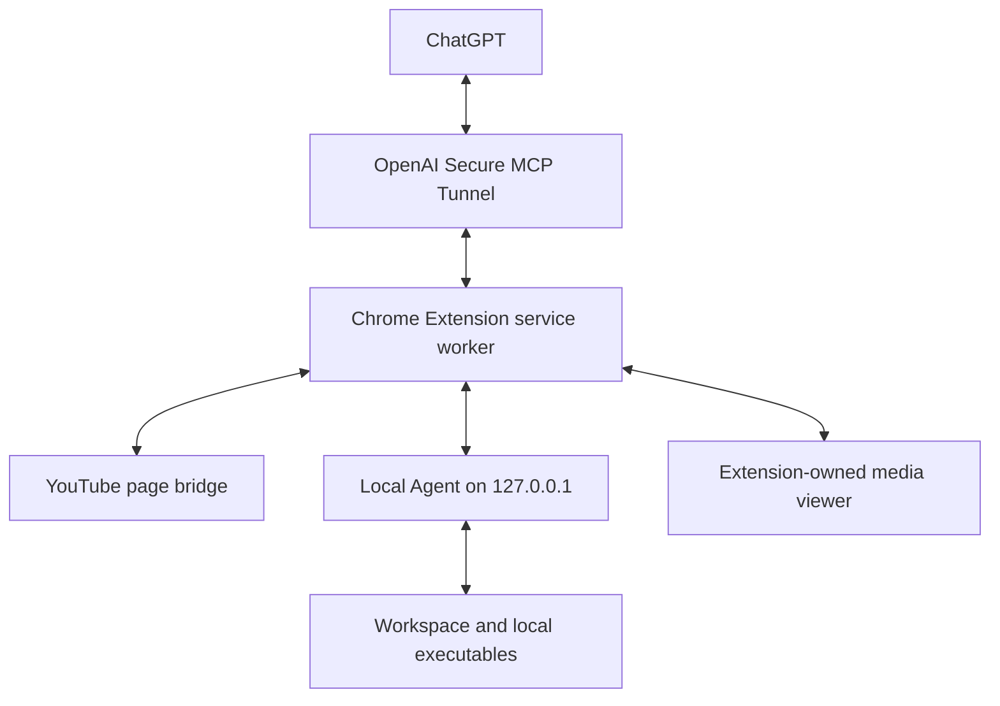
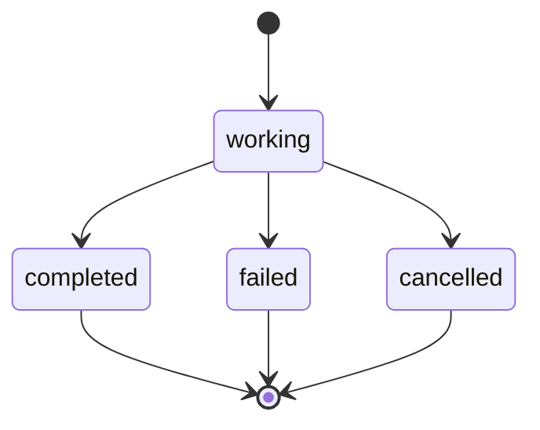

# ResearchTube architecture

## Purpose

ResearchTube connects ChatGPT to public YouTube research and local media operations without exposing a listener to the internet or sending large local media through MCP. The Chrome Extension is the MCP server and browser automation layer. The optional Python Local Agent owns local executables, the Workspace and media processing.

## System topology

```mermaid
flowchart TD
    C[ChatGPT] <--> T[OpenAI Secure MCP Tunnel]
    T <--> E[Chrome Extension service worker]
    E <--> Y[YouTube page bridge]
    E <--> A[Local Agent on 127.0.0.1]
    E <--> V[Extension-owned media viewer]
    A <--> W[Workspace and local executables]
```

The tunnel is outbound-only from the Extension. The Agent binds only to loopback. Browser page bridges are used only when a normal page origin or browser interaction is required.

## Components

| Component | Main sources | Responsibility |
| --- | --- | --- |
| MCP service worker | `extension/background.js` | Tunnel polling, MCP schemas, validation, task orchestration, Settings state and browser automation |
| YouTube isolated bridge | `extension/youtube-content.js` | Typed boundary between Extension messages and the YouTube page world |
| YouTube MAIN bridge | `extension/youtube-page-bridge.src.js` | Anonymous requests in a normal `youtube.com` origin for public research data |
| Storyboard Extension module | `extension/storyboards.js` | Storyboard schemas, validation and public result projection |
| ChatGPT media bridge | `extension/chatgpt-capture-frame-bridge.js` | Finds the exact MCP widget iframe and installs the local viewer overlay |
| Current-chat binding | `extension/chatgpt-chat-target-bridge.js`, `extension/ui/chat-target-v1.html` | Compact task handshake using Chrome sender identity, independent of ChatGPT layout |
| Local media viewer | `extension/media-viewer.html` | Loads image, video or audio bytes from loopback with Extension permissions |
| Settings and popup | `extension/settings.*`, `extension/popup.*` | Connection, Agent status, tool availability and bounded diagnostics |
| Local Agent | `agent/researchtube_agent.py` | Workspace, executable discovery, downloads, FFmpeg operations, speech callbacks and loopback media serving |
| Timer Agent module | `agent/timers.py`, `agent/task_history.py` | Real durations/deadlines, clock diagnostics and bounded terminal-task history |
| Storyboard Agent module | `agent/storyboards.py` | Storyboard discovery, selection, downloads, timestamps and task lifecycle |

Generated files are `extension/dist/background.js` and `extension/youtube-page-bridge.js`. Their source files must be changed first.

## MCP request lifecycle

1. The Extension reads the Tunnel ID and restricted API key from `chrome.storage.local`.
2. It long-polls the OpenAI tunnel control plane for one queued JSON-RPC request.
3. `handleMcpRequest` validates the method and selected public tool.
4. Tool input is normalized before browser or Agent work begins.
5. Browser and Agent responses are explicitly projected into the public schema.
6. The Extension posts the JSON-RPC response to the tunnel.
7. One successor poll is scheduled; alarms recover polling after service-worker suspension.

The Extension exposes both JSON text content and structured content. Expected user/input/state failures use stable structured results where defined. Unexpected failures use MCP tool errors.

## Browser research path

Public search, metadata, transcript, channel, playlist and comment operations use the YouTube page context when required. The Extension reuses a matching open YouTube tab when possible or creates an inactive tab. It never reads YouTube cookies, requests Chrome's cookies permission or performs account actions.

The isolated bridge checks the page origin and message source. The MAIN-world bridge receives only allowlisted actions and arguments. Sensitive page state, request headers, raw response bodies and private diagnostics are not returned through MCP.

Search requests are serialized, briefly cached and placed into a bounded backoff after verification, HTTP 403 or HTTP 429 responses. ResearchTube reports a retry delay rather than attempting to bypass YouTube verification.

## Local Agent boundary

The Agent is a Python asyncio HTTP service bound to `127.0.0.1`. It has no OpenAI credential. The Extension checks `/health` and requires the Agent's positive integer `interfaceVersion` to equal the Extension's required interface version before using Agent-backed tools.

Agent health is a startup snapshot. The loopback server and startup summary become available before the background diagnostic batch completes. Component versions and Chrome silent-debugger launch flags are checked exactly once per Agent run; unfinished checks report `checking` and publish their results independently. Discovery filesystem work runs outside the request event loop. `/health` only returns the prepared public snapshot: no subprocesses, component discovery, disk-space refresh, configuration reads or task-history pruning occur on this route. Platform and Workspace health/free space are captured at startup as well. Restart the Agent after changing components or Chrome launch flags to refresh diagnostics. Settings connection tests and `system_agent_status` read this same snapshot and do not refresh it.

The popup renders local connection/version information and actions independently of its Agent status request. Agent availability may initially show “Checking…”. While the one-time Chrome check remains pending, a bounded popup-only reread updates the display without triggering diagnostics; no periodic Chrome process inspection runs.

Executable discovery checks the bundled `agent/tools/<component>/` location before system `PATH`. Components currently include yt-dlp, Deno, FFmpeg, ffprobe, cloudflared and the local YouTube PO-token provider.

The Agent console may show physical installation paths for the local user. Normal health and MCP responses must not.

## Workspace model

`agent/workspace/` is the physical root, but MCP uses only logical POSIX-style paths such as `downloads/example.mp4`.

`WorkspacePathResolver` rejects:

- absolute, drive and UNC paths;
- backslashes, NUL, empty components, `.` and `..`;
- non-portable or Windows-reserved components;
- traversal outside the canonical Workspace root;
- symbolic links and supported redirect/reparse-point traversal;
- an existing destination when an operation promises no overwrite.

The Extension independently validates paths and allowlists Agent response fields. Built-in Workspace protection does not sandbox future trusted external modules, which run with the operating-system user's permissions.

## Asynchronous task model

Long-running downloads and media work use a start/status/cancel lifecycle.

```mermaid
stateDiagram-v2
    [*] --> working
    working --> completed
    working --> failed
    working --> cancelled
    completed --> [*]
    failed --> [*]
    cancelled --> [*]
```

A start call returns a task ID, initial state and `pollIntervalMs`. Status responses expose a monotonic `progressPercent` and bounded public metadata. Polling must not be faster than the returned interval. Where useful, completed outputs are published one at a time and retained if a later item fails or cancellation is requested.

FFmpeg tasks use native progress or completed-unit counts rather than fabricated timers. The Agent log appends the percentage to ordinary task status requests without dumping tool inputs or internal callback routes.

All Agent task managers retain only the latest `limits.completedTaskHistoryLimit` terminal records (default 2000), after each runner actually finishes. Queued/working tasks are preserved. Eviction releases task metadata, diagnostics and result references, never Workspace files. Extension-owned Library and current-chat tasks apply the same configured per-manager cap to their Maps and persisted task records. Limits are read on demand. Storyboard publication fingerprints are also bounded; eviction only requires content verification again when reusing a file.

Timers use the same task lifecycle, ordinary short task IDs and compact percentage logs. `agent/timers.py` separates monotonic relative duration from calendar deadlines, obtains an optional HTTPS UTC sample, returns clock-change warnings and detects suspend where system counters support it. Timers remain only in memory; restart/history eviction gives a meaningful not-found result. They cannot independently wake ChatGPT. See [TIMERS.md](features/TIMERS.md).

The developer default for automatically discovered custom tools lives in `agent-config.json` as `newToolsEnabledByDefault`, not in the Settings UI. New built-in tools default to enabled independently of this parameter. Individual saved tool choices remain authoritative. The Extension reads the default when registering a previously unknown custom tool and uses its last known default (initially true) if the Agent is unavailable.

## Media processing

- `ffprobe` supplies stream, format, chapter and program metadata.
- `ffmpeg` performs frame extraction, visual maps, image crop, screen/camera capture and media clipping.
- `yt-dlp` resolves formats and downloads complete or partial public YouTube media.
- YouTube storyboards download ready-made JPEG sheets rather than video.
- Google Translate TTS is driven in a retained background tab. Source text is inserted by script, the listen control is clicked with CDP browser input, and file output is collected from CDP network response bodies.
- Windows TTS uses Windows speech voices and produces WAV output.

Media creation tools return Workspace metadata and normally do not render a widget. `media_show` is the explicit presentation action.

## ChatGPT local-media viewer

An MCP widget remains the conversation anchor but cannot reliably fetch loopback media under ChatGPT's iframe CSP. The widget announces its identity. The ResearchTube content script locates the exact iframe by `event.source` and overlays an Extension-owned `media-viewer.html` frame in the same position.

The viewer receives verified logical metadata, constructs the loopback request in the Extension security context and loads bytes directly from the Agent. Images are loaded normally; video and audio use HTTP byte ranges for seeking. Media bytes, loopback URLs and physical paths are not placed in the MCP result.

## ChatGPT file submission

Library storage and `media_to_chat` share serialized CDP file-chooser, attachment and Send automation. The Agent resolves logical Workspace paths through separate private endpoints and partitions eligible files from files exceeding each feature's configured size limit. Physical paths stay in the private Extension–Agent exchange; public task documents expose only logical paths.

Library uses a dedicated background service conversation. `media_to_chat` uses its compact MCP service widget to obtain the originating tab from a Chrome-authenticated content-script sender; MCP transport itself supplies no originating tab ID. A private per-task capability reaches only the widget through result metadata. Before any Composer changes, the task binds to that exact tab ID and conversation, never to the active tab or focused window. A 30-second missing-handshake timeout, a missing/closed tab, or multiple open tabs showing the originating conversation fails the task without choosing an alternate destination. The task rechecks that tab and conversation before attachment and Send. `composerPolicy` either requires no text/attachments (default), or explicitly clears both once through the existing text-clear routine and scoped attachment removal controls. Labelled `Remove <filename>` buttons for the initial attachment batch are invoked through their React click handler even when hover-only CSS keeps them transparent; each removal must be confirmed before upload. Unlabelled controls retain the bounded pointer-hover/CDP path. The page-side Composer helper in `extension/chat-composer.js` resolves one visible draft editor and its `data-composer-body` or form. Text operations, scoped file acceptance and Send use that same resolver. Hidden legacy textareas are ignored; ambiguous visible editors stop automation. Attachment wrappers and nested previews count once, and filenames verify cards when React resets file inputs. A host-inserted `(YYYYMMDD-HHMMSS)` suffix immediately before the extension is accepted only relative to the full original stem and extension; exact names are reserved first and batch multiplicity is preserved. Arbitrary renames, numeric collision suffixes, different extensions, extra/missing cards and trusted user changes still stop Send. The helper inspects only the draft area and tracks trusted user edits during upload. A later edit stops Send and leaves uploaded files in place; cleanup removes only its event listeners. It never creates or activates another tab. Tasks persist in Extension storage, use phase-based monotonic progress, and support cancellation until the Send click starts. Queued and interrupted attachment/submitting operations are not replayed after an Extension worker restart; stale tab IDs must not be reused.

The service widget displays one compact row: “ResearchTube · Adding files to chat…”. Its own HTML is 32px high and requests no border. Resource metadata declares `openai/ui.availableDisplayModes: ["inline"]` so this service component is not advertised for fullscreen or PiP; the installed ChatGPT host must honor that declaration. It reports height through the MCP Apps `ui/notifications/size-changed` notification (`{height: 32}`) and the optional ChatGPT helper `window.openai.notifyIntrinsicHeight(32)`, which accepts a number. The host controls the final iframe and initial reserved height; ResearchTube does not guarantee a particular host minimum or eliminate the host's initial layout transition. No external CSS hides the widget, and the binding content script never changes ChatGPT container styles, removes host nodes or relays sizing through nested frames. Binding uses documented tool-result metadata, private events/markers and Chrome sender identity, with no ChatGPT CSS classes or message-text matching. Late metadata/content-script injection and transient runtime failures retry within the existing 30-second task deadline. Binding success is not upload or Send completion; the caption describes the operation, while `media_to_chat_status` provides the authoritative outcome. Binding errors use a short visible message and bounded console diagnostics. The separate `media_show` viewer remains unchanged.

A positive `sendDelaySeconds` splits file attachment and Send into separate serialized CDP sessions. The page-side edit guard stays installed while CDP is detached; only task state, filenames, logical paths and a guard token are persisted for the waiting stage, never Agent host paths. A short timer and a Chrome alarm wake the task no earlier than `sendNotBefore`; long waits use the alarm without blocking the global file-automation queue. `waitingToSend` may survive MV3 worker suspension because no Send was attempted; resume requires the same originating tab, conversation and live guard token. Reloading/navigating the page invalidates that guard and stops Send. Other tabs can submit while one task waits, but a second task using the reserved Composer is refused before mutation. Cancellation is marked synchronously before cleanup and checked at operation boundaries and while waiting for Send readiness. A synchronous commit immediately before trusted mouse input makes cancellation lose once Send starts. Cleanup disposes only the private guard, alarm and debugger session; it never removes attachments or clears text.

Current-chat attachment can wait for the initiating assistant response to finish before Send becomes enabled. Status and cancellation remain available in that same turn: a positive delay allows inspection of `waitingToSend`, countdown and pre-Send cancellation. For actual submission, finish the response after any required pre-Send checks instead of indefinitely polling completion while Send is disabled. The automatically sent attachment message can trigger a following turn to verify completion; timers do not resume ended assistant responses. Completion means a Send click, without claiming downstream upload processing or Library availability.

## Speech path

Google Translate speech uses a retained inactive tab. ResearchTube waits for full page readiness, clears earlier text, inserts and verifies new text, waits for the source listen control to become enabled, emulates focus and an active page lifecycle through CDP, then clicks `aria-label="Listen to source text"` with browser input. The tab is never closed by the task.

For file-only output, the tab is muted during playback. ResearchTube waits for playback completion and the collected audio response before saving and restoring the previous mute state. For speakers or both, playback remains audible as requested.

## Security and privacy

- The Tunnel key is sent only to the OpenAI control plane.
- YouTube requests omit credentials and do not use account actions.
- Diagnostics exclude credentials, Tunnel IDs, cookies, request headers, signed URLs, transcript bodies and unbounded child-process output.
- Agent HTTP access is loopback-only.
- Public shares are explicit, temporary cloudflared operations and never expose the Agent API.
- File creation is non-overwriting by default.
- Clipboard, screen and camera access occur only through explicit tool calls.

## Compatibility and versions

Extension and Agent implementation versions are independent. Increment only the component whose behavior changes; synchronize their implementation versions only on an explicit user request. Compatibility is governed by the separate interface version. The Extension refuses Agent-backed calls when the versions do not match, while browser-only YouTube research remains available.

Current values must be read from code or `system_agent_status`; documentation does not hard-code release numbers.

## Source of truth

- Public tool schemas and routing: `extension/background.js` and feature modules.
- Agent HTTP routing and behavior: `agent/researchtube_agent.py` and `agent/storyboards.py`.
- Manifest permissions: `extension/manifest.json`.
- Build and test commands: `extension/package.json`.
- Stable architectural intent and invariants: this document and repository-root `AGENTS.md`.
