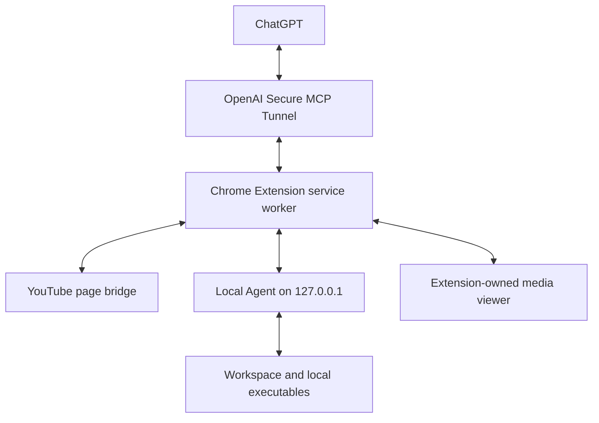
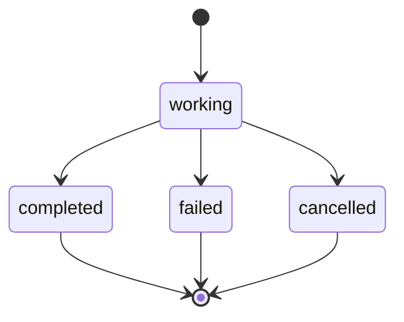

# ResearchTube architecture

## Purpose

ResearchTube connects ChatGPT to public YouTube research and local media operations without exposing a listener to the internet or sending large local media through MCP. The Chrome Extension is the MCP server and browser automation layer. The optional Python Local Agent owns local executables, the Workspace and media processing.

## System topology

```mermaid
flowchart TD
    C[ChatGPT] <--> T[OpenAI Secure MCP Tunnel]
    T <--> E[Chrome Extension service worker]
    E <--> Y[YouTube page bridge]
    E <--> A[Local Agent on 127.0.0.1]
    E <--> V[Extension-owned media viewer]
    A <--> W[Workspace and local executables]
```

The tunnel is outbound-only from the Extension. The Agent binds only to loopback. Browser page bridges are used only when a normal page origin or browser interaction is required.

## Components

| Component | Main sources | Responsibility |
| --- | --- | --- |
| MCP service worker | `extension/background.js` | Tunnel polling, MCP schemas, validation, task orchestration, Settings state and browser automation |
| YouTube isolated bridge | `extension/youtube-content.js` | Typed boundary between Extension messages and the YouTube page world |
| YouTube MAIN bridge | `extension/youtube-page-bridge.src.js` | Anonymous requests in a normal `youtube.com` origin for public research data |
| Storyboard Extension module | `extension/storyboards.js` | Storyboard schemas, validation and public result projection |
| ChatGPT media bridge | `extension/chatgpt-capture-frame-bridge.js` | Finds the exact MCP widget iframe and installs the local viewer overlay |
| Local media viewer | `extension/media-viewer.html` | Loads image, video or audio bytes from loopback with Extension permissions |
| Settings and popup | `extension/settings.*`, `extension/popup.*` | Connection, Agent status, tool availability and bounded diagnostics |
| Local Agent | `agent/researchtube_agent.py` | Workspace, executable discovery, downloads, FFmpeg operations, speech callbacks and loopback media serving |
| Storyboard Agent module | `agent/storyboards.py` | Storyboard discovery, selection, downloads, timestamps and task lifecycle |

Generated files are `extension/dist/background.js` and `extension/youtube-page-bridge.js`. Their source files must be changed first.

## MCP request lifecycle

1. The Extension reads the Tunnel ID and restricted API key from `chrome.storage.local`.
2. It long-polls the OpenAI tunnel control plane for one queued JSON-RPC request.
3. `handleMcpRequest` validates the method and selected public tool.
4. Tool input is normalized before browser or Agent work begins.
5. Browser and Agent responses are explicitly projected into the public schema.
6. The Extension posts the JSON-RPC response to the tunnel.
7. One successor poll is scheduled; alarms recover polling after service-worker suspension.

The Extension exposes both JSON text content and structured content. Expected user/input/state failures use stable structured results where defined. Unexpected failures use MCP tool errors.

## Browser research path

Public search, metadata, transcript, channel, playlist and comment operations use the YouTube page context when required. The Extension reuses a matching open YouTube tab when possible or creates an inactive tab. It never reads YouTube cookies, requests Chrome's cookies permission or performs account actions.

The isolated bridge checks the page origin and message source. The MAIN-world bridge receives only allowlisted actions and arguments. Sensitive page state, request headers, raw response bodies and private diagnostics are not returned through MCP.

Search requests are serialized, briefly cached and placed into a bounded backoff after verification, HTTP 403 or HTTP 429 responses. ResearchTube reports a retry delay rather than attempting to bypass YouTube verification.

## Local Agent boundary

The Agent is a Python asyncio HTTP service bound to `127.0.0.1`. It has no OpenAI credential. The Extension checks `/health` and requires the Agent's positive integer `interfaceVersion` to equal the Extension's required interface version before using Agent-backed tools.

Executable discovery checks the bundled `agent/tools/<component>/` location before system `PATH`. Components currently include yt-dlp, Deno, FFmpeg, ffprobe, cloudflared and the local YouTube PO-token provider.

The Agent console may show physical installation paths for the local user. Normal health and MCP responses must not.

## Workspace model

`agent/workspace/` is the physical root, but MCP uses only logical POSIX-style paths such as `downloads/example.mp4`.

`WorkspacePathResolver` rejects:

- absolute, drive and UNC paths;
- backslashes, NUL, empty components, `.` and `..`;
- non-portable or Windows-reserved components;
- traversal outside the canonical Workspace root;
- symbolic links and supported redirect/reparse-point traversal;
- an existing destination when an operation promises no overwrite.

The Extension independently validates paths and allowlists Agent response fields. Built-in Workspace protection does not sandbox future trusted external modules, which run with the operating-system user's permissions.

## Asynchronous task model

Long-running downloads and media work use a start/status/cancel lifecycle.

```mermaid
stateDiagram-v2
    [*] --> working
    working --> completed
    working --> failed
    working --> cancelled
    completed --> [*]
    failed --> [*]
    cancelled --> [*]
```

A start call returns a task ID, initial state and `pollIntervalMs`. Status responses expose a monotonic `progressPercent` and bounded public metadata. Polling must not be faster than the returned interval. Where useful, completed outputs are published one at a time and retained if a later item fails or cancellation is requested.

FFmpeg tasks use native progress or completed-unit counts rather than fabricated timers. The Agent log appends the percentage to ordinary task status requests without dumping tool inputs or internal callback routes.

## Media processing

- `ffprobe` supplies stream, format, chapter and program metadata.
- `ffmpeg` performs frame extraction, visual maps, image crop, screen/camera capture and media clipping.
- `yt-dlp` resolves formats and downloads complete or partial public YouTube media.
- YouTube storyboards download ready-made JPEG sheets rather than video.
- Google Translate TTS is driven in a retained background tab. Source text is inserted by script, the listen control is clicked with CDP browser input, and file output is collected from CDP network response bodies.
- Windows TTS uses Windows speech voices and produces WAV output.

Media creation tools return Workspace metadata and normally do not render a widget. `media_image_show` is the explicit presentation action.

## ChatGPT local-media viewer

An MCP widget remains the conversation anchor but cannot reliably fetch loopback media under ChatGPT's iframe CSP. The widget announces its identity. The ResearchTube content script locates the exact iframe by `event.source` and overlays an Extension-owned `media-viewer.html` frame in the same position.

The viewer receives verified logical metadata, constructs the loopback request in the Extension security context and loads bytes directly from the Agent. Images are loaded normally; video and audio use HTTP byte ranges for seeking. Media bytes, loopback URLs and physical paths are not placed in the MCP result.

## Speech path

Google Translate speech uses a retained inactive tab. ResearchTube waits for full page readiness, clears earlier text, inserts and verifies new text, waits for the source listen control to become enabled, emulates focus and an active page lifecycle through CDP, then clicks `aria-label="Listen to source text"` with browser input. The tab is never closed by the task.

For file-only output, the tab is muted during playback. ResearchTube waits for playback completion and the collected audio response before saving and restoring the previous mute state. For speakers or both, playback remains audible as requested.

## Security and privacy

- The Tunnel key is sent only to the OpenAI control plane.
- YouTube requests omit credentials and do not use account actions.
- Diagnostics exclude credentials, Tunnel IDs, cookies, request headers, signed URLs, transcript bodies and unbounded child-process output.
- Agent HTTP access is loopback-only.
- Public shares are explicit, temporary cloudflared operations and never expose the Agent API.
- File creation is non-overwriting by default.
- Clipboard, screen and camera access occur only through explicit tool calls.

## Compatibility and versions

Extension and Agent implementation versions can change independently. Compatibility is governed only by the interface version. The Extension refuses Agent-backed calls when the versions do not match, while browser-only YouTube research remains available.

Current values must be read from code or `system_agent_status`; documentation does not hard-code release numbers.

## Source of truth

- Public tool schemas and routing: `extension/background.js` and feature modules.
- Agent HTTP routing and behavior: `agent/researchtube_agent.py` and `agent/storyboards.py`.
- Manifest permissions: `extension/manifest.json`.
- Build and test commands: `extension/package.json`.
- Stable architectural intent and invariants: this document and repository-root `AGENTS.md`.
