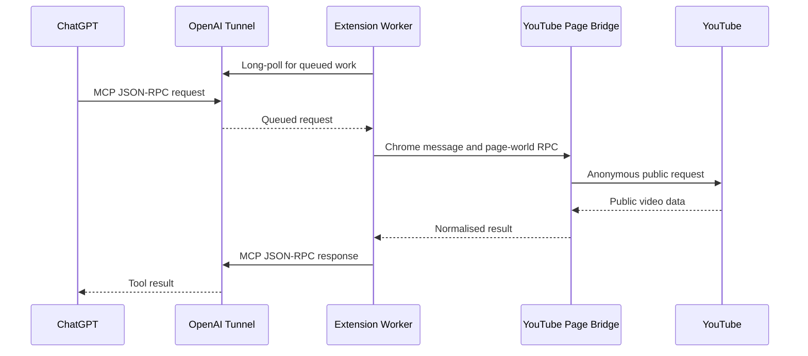

# Architecture

## Purpose and scope

ResearchTube is a Manifest V3 Chrome extension that implements a private MCP server for ChatGPT through an OpenAI Secure MCP Tunnel. It is designed for research on public YouTube content:

- video discovery;
- video metadata;
- public caption tracks and timestamped transcript text from a selected track;
- public top-level comments and selected reply threads.

The extension is not a YouTube account client. It does not use YouTube cookies, does not perform account actions, and does not support private, member-only, age-restricted, or personalised content.

## System overview



The extension is the local tunnel client and the MCP server. The OpenAI tunnel provides the private, outbound-only transport; it does not expose a listener on the user's computer. The optional Local Agent is a separate loopback-only helper; it is not part of the public MCP transport.

## Components

| Component | Source | Responsibility |
| --- | --- | --- |
| Manifest | `manifest.json` | Declares MV3 permissions, service worker, Options page, icons, and YouTube content scripts. |
| Service worker | `background.js` | Polls the tunnel, implements JSON-RPC/MCP, validates tool input, searches and reads metadata, manages YouTube tabs, and sends tool responses. |
| Isolated content script | `youtube-content.js` | Bridges extension messages to and from the YouTube MAIN world using origin-checked `window.postMessage`. |
| MAIN-world bridge | `youtube-page-bridge.src.js` → `youtube-page-bridge.js` | Runs in a `youtube.com` document and performs search, transcript, comment, and reply operations in the normal YouTube page origin without navigating the user's tab. |
| Settings and popup | `onboarding.*`, `popup.*` | Provide the single local Settings page, status, connection-test UI, and toolbar status. The Tunnel ID and restricted OpenAI API key are stored in `chrome.storage.local`; the control-plane address is fixed in the service worker. |
| Bundled dependency | `youtubei.js` | Used only in the MAIN-world bridge for comments and reply continuations. |
| Optional Local Agent | `../agent/researchtube_agent.py` | Standard-library Python asyncio service on `127.0.0.1` that owns local executable discovery, downloads, built-in sandboxed workspace operations, and media probing. |

## Request lifecycle

### Secure MCP Tunnel transport

`background.js` uses the OpenAI tunnel control plane:

1. Read the Tunnel ID and restricted API key from `chrome.storage.local`; the OpenAI control-plane address is a code constant (`https://api.openai.com`), not a user-configurable setting.
2. Long-poll `GET /v1/tunnels/{tunnel_id}/poll` with `limit=1` and a 15-second server timeout.
3. For each queued JSON-RPC command, call `handleMcpRequest`.
4. Post the MCP response to `POST /v1/tunnels/{tunnel_id}/response`.
5. Schedule exactly one successor poll shortly after the previous poll completes. Repeated wake-ups from Chrome, Settings, or the popup share that one scheduler and cannot multiply tunnel polls.

An alarm runs every 30 seconds as a recovery mechanism when Chrome has suspended the MV3 service worker. Polling is automatic and is not a user-facing setting.

The control-plane request carries the restricted OpenAI API key. It never enters a YouTube request or page-world message.

### Search pacing and YouTube verification

`youtube_search` is intentionally more conservative than the tunnel transport:

- Requests are placed in one local FIFO queue, with at least 500 ms between search starts.
- Identical `(query, limit)` calls share a cached result or in-flight request for five minutes.
- A YouTube redirect to its verification flow, an HTTP 403, or an HTTP 429 starts a persisted backoff ladder of **2, 5, 10, 20, 40, then 60 seconds**. A successful search or an expired delay resets the ladder, so a new incident always starts at two seconds.
- During the backoff ResearchTube returns the MCP tool error `YOUTUBE_SEARCH_RATE_LIMITED` with the concrete retry delay. It does not add `google.com` permissions or attempt to bypass verification.

The toolbar icon mirrors the local state: `…` while a tool runs, `!` during a YouTube-search backoff, and `×` when the tunnel connection needs attention. The popup shows the remaining search delay.

### MCP protocol handling

The worker implements these MCP methods:

- `initialize` returns server information `researchtube` and the tools capability.
- `notifications/initialized` is acknowledged without a response payload.
- `tools/list` returns the YouTube research tools, Local Agent status, Local Agent download tools, sandboxed workspace tools, and `media_probe`.
- `tools/call` validates arguments, executes the selected handler, and returns either a structured success result or a tool execution error.

Successful calls include both `content` (JSON text for compatibility) and `structuredContent` (machine-readable output). Expected execution failures return `isError: true`; malformed JSON-RPC requests use JSON-RPC errors. Normal successful outputs contain research data only: they never expose selected tab IDs, page-bridge transport, client profile, session mode, or other execution diagnostics.

Each tool definition has a title, an LLM-facing description, strict input and output JSON schemas (`additionalProperties: false`), and MCP annotations. Video metadata is read-only. Search, channel catalogues, playlists, transcript, comments, and replies are non-destructive but not strictly read-only because they may create an inactive local YouTube tab.

### Optional Local Agent contract

The Agent reads its optional `agent-config.json` `{ "port": 17843 }` and otherwise uses port `17843`. It binds only to `127.0.0.1`, creates/checks `agent/workspace/`, and uses the directory containing its script as its installation root. Components are resolved in a fixed order: their designated local `tools/` directory, then system `PATH`, then missing. Extension and Agent component versions are independent; the Extension uses the positive integer `interfaceVersion` to decide compatibility and refuses Agent-backed MCP tools unless it exactly equals its required interface version.

`GET /health` returns only non-sensitive component metadata:

```json
{
  "status": "ok",
  "agentVersion": "0.9.0",
  "interfaceVersion": 7,
  "workspace": { "status": "available" },
  "components": {
    "ytDlp": { "status": "available|missing|error", "version": "...|null", "source": "local|path|null" },
    "ffmpeg": { "status": "available|missing|error", "version": "...|null", "source": "local|path|null" },
    "ffprobe": { "status": "available|missing|error", "version": "...|null", "source": "local|path|null" }
  }
}
```

`researchtube_agent_status` has no input. The Extension normalizes health into a strict MCP output contract. A missing or unreadable interface version is represented as `null` and is incompatible. If the Agent cannot be reached, the status call remains a successful tool result rather than an MCP error:

```json
{
  "available": false,
  "error": "AGENT_UNAVAILABLE",
  "message": "ResearchTube Local Agent is not available on port 17843.",
  "status": null,
  "agentVersion": null,
  "workspace": null,
  "components": null
}
```

Physical workspace and executable paths are never returned through health or normal MCP calls. They may appear only in the local Agent console. The Agent writes compact `[HH:MM:SS]` startup and request messages to that console, and the Extension never accepts a configurable Agent host.

## Tool data paths

### Search: `youtube_search`

The worker routes search through the MAIN-world bridge in an already open YouTube document. The bridge anonymously fetches `/results?search_query=...`, extracts `ytInitialData`, and normalises `videoRenderer` entries. If the first page is not enough, it follows the search continuation through `youtubei/v1/search` using public client data extracted from the response. The bridge never changes the selected tab's URL, playback, or DOM.

Output is a compact result list with ID, title, channel, duration and publication text, normalized integer views plus YouTube's display text, and a snippet when available. Canonical video URLs are not exposed.

### Channel catalogue: `youtube_get_channel_videos`

The bridge anonymously fetches the selected channel's `/videos` page. It accepts an `@handle`, complete YouTube channel URL, or `UC...` channel ID, extracts the channel identity and compact video cards from `ytInitialData`, and follows an explicitly supplied opaque continuation through `/youtubei/v1/browse` when needed. Both legacy `gridVideoRenderer` / `videoRenderer` cards and current `lockupViewModel` cards are normalized to the same stable output.

Each item contains the video ID, title, duration and duration in seconds, publication display text, normalized integer views plus display text, and Shorts/live flags. Catalogue pages do not reliably include like or comment counts, so callers use `youtube_get_video` only for selected videos that need those details. The optional `includeShorts` and `includeStreams` filters are applied to YouTube's own renderer labels.

### Channel playlists: `youtube_get_channel_playlists`

The bridge fetches the channel's `/playlists` page using the same public page context and normalizes its playlist cards. It supports legacy playlist renderers and the current `lockupViewModel` representation. It returns playlist ID, title, displayed and normalized video count, thumbnail, and an opaque continuation. No videos are fetched by this tool; use a returned ID with `youtube_get_playlist_videos`.

### Playlist catalogue: `youtube_get_playlist_videos`

The bridge fetches `/playlist?list={playlistId}` for a public playlist ID or URL and normalizes legacy playlist renderers, playlist panel cards, and current lockup cards. It preserves the displayed playlist position when YouTube provides it, along with the same compact video fields used for channel catalogues. Continuations use anonymous `/youtubei/v1/browse` requests in the page world. This is a catalogue operation only: transcript and comments remain separate, targeted MCP calls.

### Video metadata: `youtube_get_video`

The worker anonymously fetches `/watch?v={videoId}`, extracts `ytInitialPlayerResponse` and `ytInitialData`, and returns:

- title, description, channel, duration, category, tags, thumbnail, and caption-track metadata only (not caption text). Every track includes a zero-based `trackIndex`, language code, display name, and auto-generated flag;
- normalized integer views, likes, and comment count, each paired with the original YouTube display text;
- an absolute publication date when YouTube supplies one.

### Transcript: `youtube_get_transcript`

Transcript retrieval runs in the YouTube MAIN world to use a normal `youtube.com` request context while staying anonymous:

1. The worker reuses the first open `https://www.youtube.com/` tab. If none exists, it creates one with `active: false` and waits for it to load. If the selected tab disappears or its page bridge becomes unreachable while the operation is running, the worker creates one fresh inactive tab and retries the operation once.
2. The isolated content script sends a `transcript-player` RPC through `window.postMessage`.
3. The MAIN-world bridge anonymously fetches `/watch?v={videoId}` and extracts the current `INNERTUBE_API_KEY`.
4. It sends a minimal `ANDROID /youtubei/v1/player` request with client version `20.10.38`.
5. It selects `captionTracks[trackIndex]`. `trackIndex` defaults to `0`, the primary public track; callers can obtain the available choices from `youtube_get_video` and request another track explicitly.
6. It fetches the selected track's `baseUrl` with `credentials: "omit"`.
7. It parses JSON3 or XML timedtext into ordered `{ start, duration, text }` segments.

The XML parser handles both common timestamp forms:

- `start` / `dur` in seconds;
- srv3 `t` / `d` in milliseconds.

The parser deliberately does not use `DOMParser`, avoiding YouTube Trusted Types restrictions in the page world.

### Comments: `youtube_get_comments`

Comments run in the MAIN world through the bundled browser build of `youtubei.js` with the `WEB` client. The bridge uses `getComments(videoId, TOP_COMMENTS | NEWEST_FIRST)` and follows continuation pages until it reaches the requested limit or YouTube has no more results.

Each thread is normalised to a stable, compact public representation: explicit YouTube rank, comment ID, author and channel ID, text, relative publication text, normalized likes and reply count paired with display text, and pinned/hearted/reply flags. YouTube does not reliably expose an absolute timestamp in every comment response, so `publishedAt` is explicitly `null` when unavailable rather than inferred from relative text.

### Replies: `youtube_get_comment_replies`

The tool first loads the comment area for the supplied video, finds the selected top-level `commentId`, obtains its thread, and follows reply continuations until the requested limit. It returns a compact parent summary, ranked replies, and `totalReplies` alongside `returned`, so a caller can distinguish the loaded sample from the whole discussion. It returns only that branch; it does not re-enumerate all top-level comments.

### Built-in workspace tools and media probe

The following Local Agent tools form the built-in filesystem layer:

- `workspace_list(path = "", limit = 100)` lists one directory. The empty string is the only representation of the workspace root; results are bounded to 500 entries.
- `workspace_stat(path)` returns type, file size when applicable, and modification time for one existing object.
- `workspace_mkdir(path)` creates a directory and any missing parents. It reports whether the final directory was newly created.
- `workspace_move(source, destination)` moves or renames one regular file or directory. Its destination parent must exist and it never overwrites.
- `workspace_delete(path)` deletes one regular file or one empty directory. It deliberately has no recursive mode.
- `media_probe(path)` invokes the locally resolved `ffprobe` with a fixed argument vector and returns only normalized container, duration, stream count, and first video/audio-stream metadata.

All built-in paths are **ResearchTube logical paths**, not operating-system paths. They are workspace-relative, use `/` on every platform, and never reveal the physical location of `agent/workspace/`. Except for the explicit empty root path accepted by `workspace_list`, a path is non-empty and consists of safe components only. The built-in grammar rejects absolute paths, drive and UNC paths, backslashes, NUL, empty components, and `.` or `..` components. New path components also reject Windows-reserved or non-portable filename forms.

`WorkspacePathResolver` is the single path-validation layer used by download output directories and all built-in filesystem/media operations. It validates logical components, constructs a native path from those components, resolves it relative to the canonical workspace root, checks path-aware containment, and refuses symbolic links and supported junction/reparse-point redirects in traversed components. Raw MCP path text is therefore never passed directly to filesystem mutators, `ffprobe`, `ffmpeg`, or `yt-dlp`.

The Extension independently validates logical inputs and allowlists every Agent response field before publishing it to MCP. Expected failures use structured codes such as `WORKSPACE_PATH_INVALID`, `WORKSPACE_PATH_OUTSIDE_SANDBOX`, `FILE_NOT_FOUND`, `DIRECTORY_NOT_FOUND`, `DESTINATION_EXISTS`, `DIRECTORY_NOT_EMPTY`, `FFPROBE_NOT_AVAILABLE`, and `MEDIA_PROBE_FAILED`. Error text does not contain physical host paths.

This sandbox applies only to **built-in ResearchTube filesystem and media tools**. Future external ResearchTube modules are trusted arbitrary local programs: they run with the current operating-system user's permissions and are not sandboxed by ResearchTube. The built-in workspace restriction must never be presented as a restriction on such modules.

## Page-context bridge

The page-context transport exists because a request sent by the extension service worker has the extension's network context, while the MAIN-world bridge performs `fetch` from a `youtube.com` document.

The boundary is intentionally narrow:

1. `background.js` sends a typed Chrome message to the tab.
2. `youtube-content.js` validates `event.source === window` and `event.origin === location.origin`.
3. It forwards only the action and non-secret arguments through `window.postMessage`.
4. `youtube-page-bridge.js` executes an allowlisted action and posts a normalised result back.

No cookie values, request headers, API key values, response bodies, transcript text, or comment text are sent through this bridge for diagnostics. The Settings diagnostic export contains only concise tool timing, safe argument summaries, errors, queue events, and YouTube HTTP metadata.

For an already open tab whose content script belongs to an older extension build, the worker does not reload the user's tab. It creates a fresh inactive YouTube tab with the current bridge instead. A pre-existing tab that predates extension installation can receive one on-demand injection of the two local bridge files. If the selected tab is closed, its bridge becomes unreachable, or its MAIN-world RPC times out mid-call, the worker performs one bounded recovery attempt with a new inactive tab. It does not retry normal YouTube or parsing errors.

## Privacy and security model

### Credentials

All YouTube data requests explicitly use `credentials: "omit"`. The manifest does not request Chrome's `cookies` permission. The extension does not use SAPISID, YouTube account headers, or personal session data.

### Secrets

The Tunnel ID and restricted OpenAI API key are stored in `chrome.storage.local`. They are not embedded in source code, committed to the repository, sent to YouTube, or exposed to the page-world bridge.

`youtubei.js` normally bundles static public YouTube client-key literals. The build step replaces those literals with a getter for the live `INNERTUBE_API_KEY` on the YouTube document. The release bundle therefore does not contain a Google-style API-key literal.

Use a dedicated key with only `Tunnels: Read + Use`. Creating or changing a tunnel should be done with a separate, more privileged Platform session or key.

### Permissions

| Permission | Why it is needed |
| --- | --- |
| `storage` | Store connection settings and last connection status. |
| `alarms` | Recover tunnel polling after service-worker suspension. |
| `tabs` | Locate or create an inactive YouTube tab. |
| `scripting` | Inject local bridge scripts into a pre-existing YouTube tab when necessary. |
| `https://api.openai.com/*` | Tunnel control-plane polling and responses. |
| `https://www.youtube.com/*` | Public YouTube pages and MAIN-world bridge injection. |
| `http://127.0.0.1/*` | Read the optional Local Agent's loopback-only `/health` endpoint. |

## Build and verification

```bash
npm install
npm run build
npm run check
```

`npm run build` bundles `background.js` to `dist/background.js` and bundles the browser-compatible `youtubei.js` dependency plus `youtube-page-bridge.src.js` into `youtube-page-bridge.js`. The extension never loads a remote script at runtime.

`npm run check` rebuilds and performs JavaScript syntax checks for the source and generated bundles. Functional verification still requires a loaded Chrome extension, an active tunnel, and publicly accessible YouTube videos.

## Repository layout

```text
.
├── background.js                 # MV3 worker and MCP server
├── youtube-content.js            # isolated-world bridge
├── youtube-page-bridge.src.js    # MAIN-world source and YouTube transport
├── youtube-page-bridge.js        # generated MAIN-world bundle
├── onboarding.html / onboarding.js # single local Settings UI
├── manifest.json                 # Chrome extension manifest
├── icons/                        # Chrome extension icon sizes
├── docs/ARCHITECTURE.md          # this document
└── docs/images/                  # redacted README screenshots
```

## Limits and maintenance

- YouTube's internal response formats and access controls can change without notice.
- Some public videos have no captions, no comments, or restricted data.
- Track `0` remains the default transcript, but callers can choose another public caption track by its `trackIndex` from `youtube_get_video`.
- The extension depends on `youtubei.js` for comments and replies. Update it carefully and verify continuations against live public videos.
- This is a private developer-mode integration. Secure MCP Tunnel does not make this extension a publicly distributed OpenAI plugin.

## Extension points

When adding a tool:

1. Add one narrowly scoped handler in `background.js`.
2. Add a precise tool definition with strict schemas, truthful annotations, and a description that tells the model what it does and does not return.
3. Reuse the page bridge only when YouTube page context is required.
4. Return normalised public data, never raw cookies or full unbounded YouTube responses.
5. Add validation in the MCP contract test and test the flow in a real Chrome profile.
